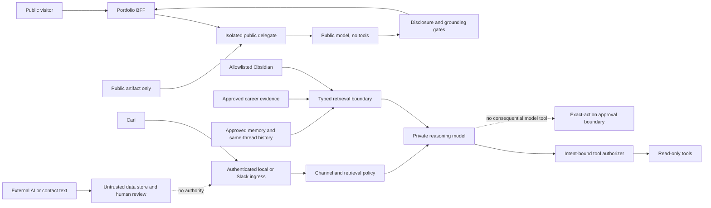

# Jolene prompt-injection threat model

Status: implementation-ready planning baseline

Owner: Carl Welch

Implementation owner: Jolene development workstream

Asana: `JOL-SEC-003` (`1217931645187988`)

Machine-readable control matrix: [`security/prompt-injection-threat-model.v1.json`](security/prompt-injection-threat-model.v1.json)

## Executive decision

Jolene has meaningful prompt-injection containment today, but she is not fully
hardened.

The public portfolio delegate has the best blast-radius boundary: it receives
only the versioned public artifact, has no private tools or session memory,
keeps structured claims and citations deterministic, and can fall back without
the model. A public injection can still manipulate generated prose or consume
budget because answer meaning is not yet deterministically validated.

The private agent carries the higher risk. Conversation history, approved
memories, task events, Obsidian excerpts, and career evidence remain raw
model-visible strings. The model can make additional private read calls across
an eight-turn loop. Channel policy controls which tools exist, but no current
control binds each tool call to Carl's authenticated intent. The prompt tells
the model that content is untrusted; that instruction is useful guidance, not a
security boundary.

A separate P0 issue precedes content hardening: the loopback private HTTP
control plane accepts caller-supplied actor, workspace, and channel values.
Loopback and same-origin restrictions are containment, not authentication.
`JOL-SEC-004A` must establish authenticated, server-derived principal and
channel scope before private tool authorization can be considered reliable.

## Authority precedence

Authority never comes from text content.

1. Deterministic runtime policy controls authenticated scope, disclosure,
   capabilities, schemas, approvals, fallbacks, and release gates.
2. Carl may state current intent or approve an exact decision only after the
   transport establishes his identity and scope.
3. A versioned exact-action approval may authorize only its fingerprinted
   actor, workspace, task, destination, content, classification, purpose, and
   unexpired single use.
4. Retrieved notes, memories, history, task events, career evidence,
   recommendations, job descriptions, contact messages, public questions,
   project data, and external-AI output have authority `none`.
5. Models and providers have authority `none`. They produce candidate output
   for deterministic validation.

Owner approval can establish factual eligibility or permitted disclosure. It
does not transform embedded commands into instructions for the runtime.

## Trust-zone flow

Dashed flows are deliberately non-authoritative. `LI`, `RT`, `PV`, and `TA`
are target controls; their current/planned status is exact in the JSON matrix.

## Current controls that are structurally enforced

| Boundary | Enforced control | Important limitation |
|---|---|---|
| Public/private separation | Public runtime receives the validated public artifact and cannot reach Obsidian, private SQLite, Slack, MCP, memory, or private tools. | Public corpus text can still poison answer prose. |
| Public model | No tools or session continuity; `store: false`; bounded strict JSON; deterministic claims/citations and fallback. | JSON shape does not establish semantic entailment. |
| Public egress | Fail-closed patterns block known credential forms, local paths/hosts, Obsidian links, emails, and phone numbers. | Does not catch arbitrary semantic disclosure, prompt narration, or unsupported public-safe claims. |
| Channel policy | Policy is resolved before content; shared Slack and unverified DMs receive no private retrieval. | Local HTTP identity is caller-asserted; owner DM identity is not yet bound to the workspace/member pair in domain policy. |
| Private tools | Five registered private tools are read-only, schema-bounded, and independently bound to the authenticated current-turn intent, exact arguments, channel scope, expiry, and per-turn budgets; external messaging has no model tool. | Authenticated ingress is still a prerequisite, and later private-RAG risk classification remains planned under JOL-SEC-007. |
| Obsidian | Read-only filesystem allowlist and bounded excerpts. | Excerpts and headings are raw model-visible Markdown without taint metadata or provider-egress screening. |
| Career evidence | Source/claim approval, current eligibility, conflict handling, citations, revocation continuity, and content-minimizing access audit. | Factual review does not sanitize embedded instructions; embeddings can send private chunks to a provider. |
| Memory | Explicit proposal/approval, sensitivity, expiry, supersession, and forgetting. | Approved content remains raw text; task events and derived copies lack a complete revocation map. |
| MCP | Local stdio, reviewed career evidence, strict schemas, read-only implementation, network-disabled container. | MCP annotations are hints; OS process launch and mounts are the actual trust boundary. |
| Contact | Literal consent, strict fields, credential rejection, owner review, retention, deletion, hosted path disabled. | Consent notice/version and backup erasure are incomplete for future activation. |
| External AI | Bounded owner-scoped packets, attributed turns, expiry, exact outbound action approval, reviewed handoff. | Incoming text lacks a typed authority/taint envelope; future transport or summarization remains blocked. |
| Auditing | Capability, knowledge, career, MCP, and public events minimize stored content. | Ledgers lack unified intent, taint, policy-version, denial, retention, and tamper-evidence contracts. |

## Controls that are guidance or heuristics—not security boundaries

- XML-like prompt sections and instructions saying content is untrusted.
- Tool descriptions telling the model to cite sources or use a tool only when
  useful.
- Literal English phrase detection for job-description injection.
- Sensitive-query keyword detection before public embeddings.
- A human or AI marking a source reviewed without an injection-content check.
- Strict JSON output without semantic validation.
- `store: false` as a substitute for a documented provider processing and
  retention review.
- MCP `readOnlyHint` or other client-visible annotations.
- Same-origin or loopback binding as a substitute for authentication.

## Critical attack paths

### AP-01 — Local principal impersonation

1. A local process or browser-assisted request reaches the private HTTP API.
2. It supplies Carl's actor ID, workspace, and a private channel kind.
3. Current scope resolution treats those fields as the private principal.
4. The model can receive private retrieval tools.

Required containment: `JOL-SEC-004A` authenticates ingress and derives scope
server-side. Private tools fail closed before that proof exists.

### AP-02 — Indirect Obsidian retrieval expansion

1. Carl asks a legitimate question.
2. A matching allowlisted note contains embedded instructions.
3. The raw excerpt enters a tool result.
4. The model follows it by issuing a broader or unrelated private search.
5. Further results influence the final answer or provider egress.

Required containment: typed untrusted envelopes, per-turn intent, query/result
budgets, pre-execution authorization, source quarantine, provider-egress policy,
and a no-tools fallback.

Implemented locally by `JOL-SEC-007`: Obsidian and career retrieval, replayed
history, durable memory, task events, work/project observations, and provider
payload classes cross the private model boundary only through the versioned
policy gate. Covered risk signals enter durable content-minimizing quarantine.

### AP-03 — Delayed conversation or memory injection

1. Third-party or attacker-authored text is pasted into a private thread or
   approved as memory/task context.
2. The content persists.
3. A later turn replays it without taint or quarantine state.
4. It changes tool selection or answer framing.

Required containment: taint propagation, compromised-turn quarantine/reset,
derivation-aware revocation, and delayed/split-turn regression fixtures.

Implemented locally by `JOL-SEC-007`: collection-level inspection catches the
versioned split-turn fixtures, active taints block later replay, and revocation
or turn reset invalidates recorded descendants. Novel semantic and multilingual
attacks remain residual risk.

### AP-04 — Public answer integrity failure

1. A visitor question or approved public claim contains hostile instructions.
2. Deterministic or semantic retrieval selects legitimate evidence.
3. The public model returns syntactically valid but unsupported prose.
4. Deterministic claim cards remain correct, masking the prose failure.

Required containment: sentence/segment-to-evidence support mappings,
deterministic entailment and prohibited-behavior validation, disclosure checks,
and exact deterministic fallback.

### AP-05 — External-AI authority confusion

1. Jenny's or Maria's AI returns a statement that looks like a decision or
   instruction.
2. A future summarizer or adapter mistakes it for Carl's approval.
3. The text influences an outbound message or other action.

Required containment: authority `none` on all incoming external-AI content,
recipient/source fingerprints, intent-bound tools, exact human approval, and no
model-exposed consequential action.

## Risk register

Scores use likelihood × impact on a 1–5 scale. Exact threat/control IDs and
recovery ownership are in the machine-readable matrix.

| Risk | Score | Owner | Required fallback |
|---|---:|---|---|
| Private indirect injection causes unrelated retrieval or disclosure | 20 | JOL-SEC-007 | Disable private model tools; use explicit user-provided context only. |
| Private control-plane identity can be impersonated locally | 20 | JOL-SEC-004A | Disable private HTTP control/chat routes until authenticated scope is restored. |
| Private provider egress exceeds Carl's intent | 20 | JOL-SEC-007 | Disable provider-backed private retrieval; use local deterministic retrieval. |
| Public model produces injected or unsupported prose | 16 | JOL-SEC-006 | Disable generation and serve deterministic evidence responses. |
| Finite tests create false confidence | 16 | JOL-SEC-008 | Revert to deterministic/no-tool mode until the changed stack is reviewed. |
| Raw retention enables delayed reinjection or incomplete erasure | 16 | JOL-SEC-009 | Quarantine the source, rebuild indexes, and restore known-good state. |
| Future action adapter inherits model authority | 15 | JOL-SEC-005 | Remove the adapter; retain proposal-only human workflow. |
| Telemetry leaks content or cannot reconstruct an incident | 12 | JOL-SEC-009 | Disable the affected sink; use local gate evidence until repaired. |
| Hosted topology bypasses local budget/audit | 12 | JOL-SEC-009 | Disable public generation or the delegate; keep static portfolio available. |

## Data, provider, retention, and revocation requirements

The JSON inventory is authoritative for each data class. These rules apply to
all child tickets:

- Model/provider egress is a separately authorized use, not an incidental side
  effect of retrieval.
- Every model-visible item must carry origin, authority, classification,
  purpose, review/freshness/revocation state, disclosure ceiling, and taint
  lineage.
- No private item may leave its disclosure ceiling merely because the model
  requests another tool.
- Conversation, task-event, packet, contact, and audit stores require explicit
  retention, deletion, quarantine, backup, and security-hold behavior.
- Revocation must identify derived indexes, public artifacts, caches, packets,
  summaries, provider operations, backups, and audit tombstones. It must not
  imply deletion where an external copy cannot be recalled.
- Machine security logs contain stable reason codes, versions/hashes, counts,
  timing, correlation IDs, and taint IDs only—never prompts, excerpts, contact
  messages, paths, credentials, or provider error bodies.

## Blocking gates

1. Private HTTP and Slack owner scope are server-derived from authenticated
   transport identity (`JOL-SEC-004A`).
2. Every model-visible content item uses a typed untrusted envelope
   (`JOL-SEC-004`).
3. Every tool call is authorized outside the model against current intent,
   actor, workspace, channel, purpose, data class, scope, arguments, call/result
   budget, and expiry (`JOL-SEC-005`).
4. Private RAG cannot broaden retrieval or provider egress because of embedded
   content; provider egress defaults to local-only and requires an explicit
   approved-provider configuration (`JOL-SEC-007`).
5. Public generated prose is evidence-entailing or exact deterministic fallback
   is returned (`JOL-SEC-006`).
6. All blocker adversarial metrics pass at 100%; live cases have hash-bound
   human review and stale decisions fail closed (`JOL-SEC-008`).
7. Content-minimizing telemetry, retention/revocation behavior, incident
   controls, and stale release gates are verified (`JOL-SEC-009`).
8. No consequential capability becomes a model tool until all applicable gates
   and exact-action approval invariants pass.

Passing gates reduce known risk. They do not prove that prompt injection is
impossible.

## Delivery sequence

Only one parent Jolene ticket may be in progress. Its implementation subtasks
may also be in progress; each subtask moves to Complete as soon as its defined
scope and tests finish.

1. `JOL-SEC-003` — freeze and validate this model.
2. `JOL-SEC-004A` — authenticate private ingress and derive scope.
3. `JOL-SEC-004` — typed untrusted-content envelopes.
4. `JOL-SEC-005` — intent-bound tool authorization.
5. `JOL-SEC-007` — private Obsidian, memory, career RAG, MCP, provider egress,
   quarantine, and cross-turn hardening.
6. `JOL-SEC-006` — public semantic grounding and fail-closed output validation.
7. `JOL-SEC-008` — deterministic/live adversarial suite and reliable harness.
8. `JOL-SEC-009` — security telemetry, retention, incident recovery, tabletop,
   and release checklist.

A blocked ticket returns to Backlog with its exact prerequisite. Development
completion is distinct from PR, deployment, promotion, or production
verification.

## Test ownership

| Evidence | Responsible | Independent review |
|---|---|---|
| Domain schemas and deterministic policy | Jolene implementation agent | Security review agent |
| Private ingress and boundary integration | Jolene implementation agent | Platform/security reviewer |
| Portfolio BFF and browser isolation | Portfolio agent | Jolene security workstream |
| Adversarial fixtures and mutation families | Evaluation owner | Reviewer other than the feature implementer |
| Live-model packet | Jolene evaluation runner | Carl plus independent reviewer |
| Consent, retention, deletion, and revocation | Privacy implementation owner | Carl/privacy reviewer |
| Incident tabletop and restore evidence | Operations/security owner | Carl accountable |

## RACI

| Activity | Responsible | Accountable | Consulted | Informed |
|---|---|---|---|---|
| Threat model and policy | Jolene security workstream | Carl | Platform, AI-security, trust/privacy reviewers | Portfolio agent |
| Source and private-memory approval | Evidence/review workflow | Carl | Security/privacy | Jolene workstream |
| Public corpus approval/revocation | Jolene evidence workflow | Carl | Portfolio agent, privacy/rights | Operations |
| Private tool authorization and taint controls | Jolene backend/security | Carl | Evaluation owner | Slack integration owner |
| Public answer validation | Jolene backend/security | Carl | Portfolio agent | Recruiter-facing reviewer |
| Adversarial evaluation | Independent evaluation owner | Carl | Implementer/security | Project agents |
| Incident response and credential rotation | Operations/security | Carl | Provider and affected project owners | Affected stakeholders |

## Escalation and containment triggers

Immediately disable or quarantine the affected path when:

- retrieved content changes a query, tool, recipient, destination,
  classification, approval, or policy;
- private material reaches shared Slack, public output, an external AI, or an
  unauthorized provider operation;
- a new write tool, remote MCP endpoint, shared-channel retrieval, client-AI
  transport, or public contact workflow is proposed;
- source fingerprint, approval, consent, rights, or revocation state changes;
- audit is unavailable, corrupted, bypassed, or shows unexplained access;
- a generated public sentence cannot be supported by selected evidence;
- credentials, private paths, contact data, or sensitive inference appears in
  output;
- provider model, embedding model, retention terms, or subprocessors change;
- retrieval breadth, denials, costs, or cross-task access spike.

The incident workflow must support separate switches for public generation,
public delegate, private retrieval, Slack, embeddings, external-AI exchange,
contact capture, and individual sources. Recovery requires evidence
preservation, credential rotation when exposure is plausible, source
quarantine, index rebuild, corpus revocation, known-good restore, regression
fixture creation, and explicit re-enable approval.

## Specialist validation incorporated

Three read-only specialist reviews were integrated into the canonical model:

- Platform architecture: added private-ingress identity, Slack workspace
  binding, provider boundaries, retention, hosted-instance admission/telemetry,
  and the distinction between post-operation audit and authorization.
- AI-agent security: added typed taint, per-turn intent authorization,
  cross-turn quarantine, evidence-poisoning, answer-entailment, and explicit
  structural-versus-prompt-only control classification.
- Trust/privacy/governance: added provider-egress purpose, consent/revocation
  propagation, record-specific retention/deletion, external-AI provenance,
  incident escalation, independent review, and content-minimizing audit
  requirements.

No reviewer changed files, tickets, runtime state, or deployment state.
