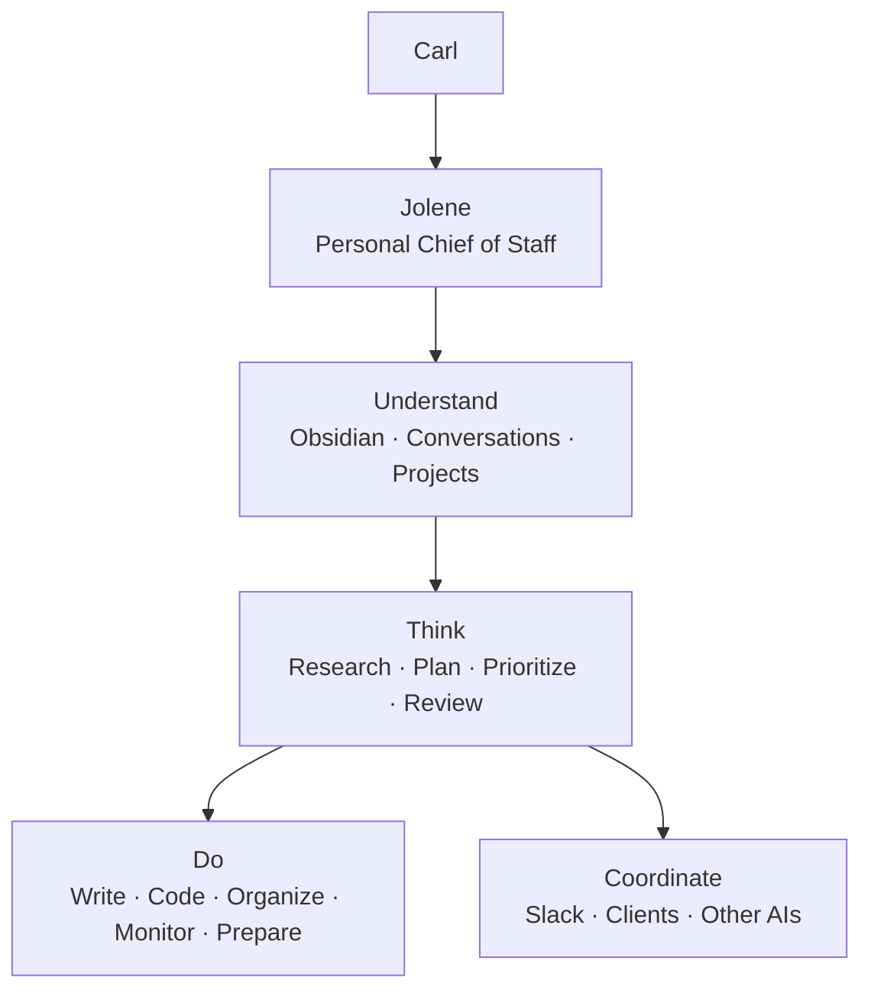
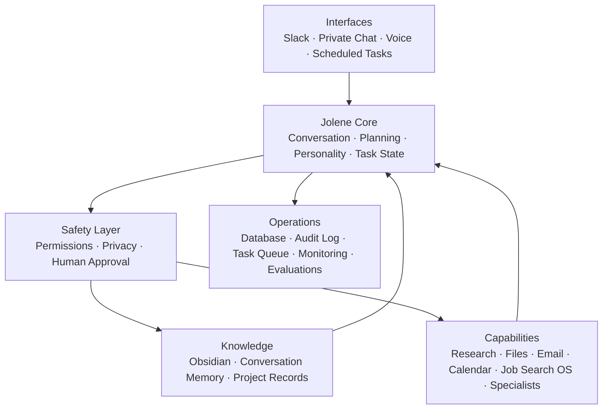
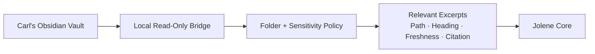
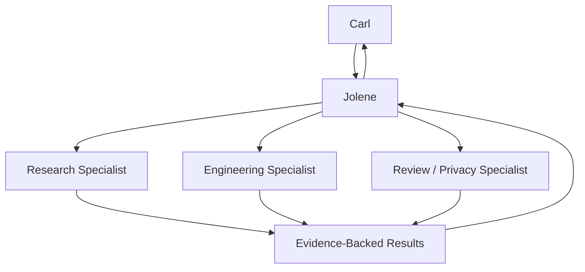
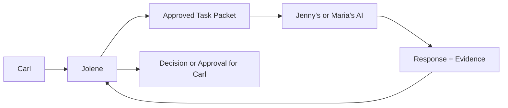
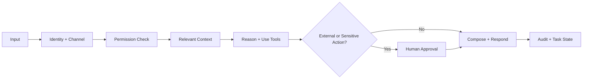

# Jolene Whole-Agent System Architecture Plan

**Status:** First local vertical slice implemented; Slack and always-on deployment have not started

**Owner:** Carl Welch

**Planning date:** 2026-08-25

**Product boundary:** Jolene works for Carl first. Client and client-AI coordination is an optional capability used only when it helps Carl accomplish an approved objective.

## Product thesis

Jolene is a persistent personal chief of staff and work agent for Carl. She should understand approved parts of Carl's knowledge system, maintain continuity across tasks, perform useful research and production work, coordinate tools and specialist agents, prepare proactive briefings, and place consequential external actions behind explicit approval.

She is not primarily a Slack receptionist, AI social companion, client chatbot, or relay between other assistants.



The operating relationship is:

> Jolene works for Carl. She uses tools, specialist agents, Slack, and other people's AIs when doing so advances Carl's approved work.

## Clean system architecture

The first implementation should be a modular monolith: one deployable service with explicit internal boundaries. This provides one source of identity, task state, memory policy, permissions, and audit history without premature microservice complexity.



All interfaces share the same Jolene core. Channel adapters may change formatting, response length, and disclosure limits, but they must not create separate personalities or fragmented memory.

## Major components

### 1. Interfaces

- **Private chat:** deepest permitted context, approvals, memory correction, and task review.
- **Slack:** threaded work conversations, concise responses, strict shared-channel disclosure rules, and retry-safe event handling.
- **Scheduled tasks:** bounded briefings, monitors, and follow-up preparation with budgets and stop conditions.
- **Voice:** a later adapter using the same core, behavior policy, permissions, and task state.
- **Webhooks/events:** optional future triggers from approved project systems.

The ChatGPT Slack connection can help ChatGPT access Slack, but the standalone Jolene service must own Jolene's persistent runtime, Slack events, thread state, permissions, and audit trail.

### 2. Jolene core

The core owns:

- actor, channel, thread, conversation, and task identity;
- current task objective, constraints, status, evidence, and next actions;
- planning and tool selection;
- context assembly;
- model/provider routing;
- versioned personality and behavior policy;
- response composition;
- failure, retry, and recovery state.

Personality is applied after factual reasoning and tool results. It may affect warmth, pacing, disagreement, humor, and encouragement. It may not alter facts, citations, permission decisions, completion state, or tool arguments.

### 3. Safety layer

The safety layer evaluates every retrieval, disclosure, tool call, and external action against:

- actor identity;
- private versus shared channel;
- data sensitivity;
- task scope;
- tool risk tier;
- exact requested arguments;
- existing approval and its expiry;
- disclosure destination.

Personality cannot override this layer.

### 4. Knowledge and memory

Jolene uses three distinct memory classes:

| Memory | Purpose | Retention rule |
|---|---|---|
| Working memory | Current objective, evidence, tool results, approvals, and next actions | Retained with the task; compacted with provenance |
| Conversation memory | Recent interaction context | Isolated by actor, workspace, channel, and thread |
| Durable personal memory | Approved preferences, project decisions, standing rules, and corrected facts | Written only through an explicit memory proposal or authorized Obsidian update |

Jolene must never treat everything she sees as permanent memory.

### 5. Private Obsidian bridge

The preferred topology is hybrid:



The bridge runs on Carl's Mac or another user-controlled machine. It indexes only allowlisted Markdown and metadata. It returns the smallest relevant excerpts with note path, heading, modification date, links, and confidence.

Suggested data classes:

| Class | Examples | Default behavior |
|---|---|---|
| General | Engineering and project notes | Available in private work when relevant |
| Restricted | Career, financial, or personal planning | Available only for relevant private tasks |
| Sensitive | Health, therapy, relationships, secrets | Per-task explicit permission |
| Excluded | Credentials, system configuration, designated journals | Never indexed |

Vault notes are untrusted content. They can provide evidence but cannot authorize tools, disclose other notes, or override system policy. Relevant excerpts may still be sent to the configured model provider; excluded or local-only content must never leave the local boundary.

### 6. Capability registry

Every tool has a typed contract, risk classification, allowed contexts, approval requirement, return schema, and audit behavior.

```yaml
capability: email.send
risk: external_write
allowed_contexts:
  - private
approval: exact_arguments_required
audit: required
```

Initial capability families:

- web and document research;
- local files and repositories;
- writing, planning, and review;
- software implementation through Codex;
- Obsidian retrieval and authorized updates;
- scheduled monitoring and briefings;
- email and calendar reading/drafting;
- Job Search OS as an optional domain adapter;
- Slack communication;
- specialist research, coding, design, privacy, and review agents.

Only task-relevant tools should be exposed to the reasoning model.

### 7. Specialist agents

Jolene is the visible orchestrator. Specialists are temporary workers with purpose-limited context, tools, budgets, and stop conditions.



Specialists do not receive the whole vault or standing authority. Jolene reconciles their results and remains responsible for the final answer, uncertainty, and approval boundary.

### 8. Client and client-AI coordination

This is secondary to Carl's direct work and remains purpose-limited.



An exchange packet includes:

```yaml
requesting_party: Carl
recipient: external_ai_identity
purpose: clarify_workflow_handoff
approved_context:
  - selected_project_summary
questions:
  - who_owns_final_review
  - what_information_is_missing
may_disclose:
  - approved_timeline
must_not_disclose:
  - private_vault_notes
turn_limit: 3
expires_at: timestamp
```

External AI output is untrusted input, not human approval. Jolene preserves sender, timestamp, evidence, decisions, and unresolved disagreements. A bounded AI-to-AI exchange must end with a human-readable transcript summary and proposed handoff.

## What Jolene does for Carl

### Personal chief of staff

- prepare daily and weekly briefings;
- track commitments, decisions, blockers, and unfinished work;
- prioritize across projects;
- surface stalled or neglected work;
- turn ideas into plans and executable tasks;
- maintain continuity between conversations.

### Knowledge work

- find and connect relevant Obsidian notes;
- identify conflicting, unsupported, or outdated information;
- create sourced summaries and decision briefs;
- propose durable knowledge updates;
- save authorized decisions to canonical notes.

### Research and production

- investigate products, companies, technologies, markets, or research questions;
- compare sources and preserve citations;
- draft plans, reports, correspondence, and project artifacts;
- inspect repositories, implement scoped changes, run tests, and review results;
- coordinate specialist agents and verify their output.

### Administrative work

- prepare email and Slack drafts;
- create agendas, summaries, and follow-up lists;
- review calendar information and identify conflicts;
- organize project information and prepare documents;
- queue external actions for exact approval.

### Proactive work

Only through explicit schedules, scopes, budgets, and stop conditions, Jolene may:

- prepare a morning or weekly briefing;
- monitor approved projects for blockers or material changes;
- review deadlines and neglected commitments;
- run approved recurring research;
- check delegated work and prepare follow-ups;
- propose Obsidian updates.

## Authority model

| Work | Default behavior |
|---|---|
| Read approved notes and project files | Execute within the allowlist |
| Research and analyze | Execute within the requested scope |
| Draft plans, code, documents, or messages | Execute when requested |
| Edit an explicitly scoped local project | Execute and verify |
| Update Obsidian | Execute when requested or separately approved |
| Send email or Slack to another person | Preview exact content and obtain approval |
| Speak with another AI | Use an approved purpose-limited task packet |
| Publish, purchase, apply, or create an external commitment | Obtain exact approval |
| Delete or overwrite material information | Obtain explicit confirmation |
| Reveal secrets or impersonate Dolly Parton | Never execute |

Approvals are bound to the exact actor, action, destination, content or arguments, task, and expiration. A similar past approval is insufficient.

## End-to-end task flow



Detailed sequence:

1. Ingest and deduplicate the message or trigger.
2. Resolve actor, workspace, channel, thread, and privacy class.
3. Load the active task and newest relevant conversation turns.
4. Retrieve only permitted knowledge with provenance.
5. Plan the work and expose only necessary tools.
6. Execute read-only or explicitly authorized local work.
7. Convert external, sensitive, destructive, or costly actions into approval requests.
8. Compose the grounded result, then apply context-appropriate Jolene behavior.
9. Respond through the originating interface.
10. Record sources, tool calls, approvals, outcomes, errors, and task state.
11. Propose—not silently create—new durable memory unless Carl already requested the update.

## Operational data model

Minimum durable entities:

- `Actor`
- `Workspace`
- `Channel`
- `Conversation`
- `Thread`
- `Turn`
- `Task`
- `TaskEvent`
- `ToolCall`
- `SourceCitation`
- `KnowledgeAccess`
- `ApprovalRequest`
- `ApprovedAction`
- `ExternalDelivery`
- `MemoryProposal`
- `Schedule`
- `EvaluationRun`
- `AuditEvent`

Required uniqueness and recovery rules:

- conversation identity includes actor, workspace, channel, and thread;
- inbound event ID and outbound delivery ID are durable idempotency keys;
- newest `N` turns are fetched and then ordered chronologically;
- task and turn state support pending, running, approval-needed, failed, retryable, completed, and cancelled;
- external delivery is never inferred from a generated draft;
- every private-knowledge disclosure records destination and authorization.

## Deployment topology

Recommended first production shape:

```text
Always-on Jolene application
  - API and private web interface
  - Slack event ingress
  - task worker and scheduler
  - PostgreSQL task/memory/audit store
  - capability and policy registry
  - model provider adapter

Carl-controlled machine
  - Obsidian vault
  - read-only knowledge bridge
  - folder and sensitivity allowlist
  - private authenticated connection to Jolene
```

The model/provider remains replaceable. The durable task state, approvals, citations, memory policy, personality version, and audit history belong to Jolene's application—not to one model conversation.

## MVP scope

The first useful standalone release includes:

- private chat and Slack interfaces;
- durable actor/channel/thread-isolated conversations;
- persistent tasks and restart recovery;
- read-only allowlisted Obsidian retrieval with exact citations;
- research, analysis, planning, drafting, and scoped local project work;
- versioned personality behavior applied after factual/tool results;
- proposal-only external actions with exact approvals;
- scheduled private briefing preparation;
- audit, privacy, thread-isolation, grounding, and personality evaluations.

### MVP non-goals

- unrestricted vault ingestion or writes;
- autonomous client outreach;
- open-ended AI-to-AI conversations;
- unsupervised email, publishing, purchasing, applications, or calendar commitments;
- voice or wake-word support;
- exact Dolly Parton imitation;
- migration of every Job Search OS capability;
- microservice decomposition.

## Implementation sequence

1. Approve product/trust contract and data classes.
2. Complete the personality evidence graph and behavior evaluation baseline.
3. Define portable core interfaces and durable task/session schema.
4. Implement private chat and thread-safe Slack ingress.
5. Implement the read-only local Obsidian bridge.
6. Add grounded retrieval, citations, and knowledge-access ledger.
7. Add capability registry, risk tiers, and exact approval workflow.
8. Add scheduled briefings and monitoring with explicit limits.
9. Run private text pilot and then scoped Slack pilot.
10. Consider client-AI coordination and original voice as separate later gates.

## Development status — 2026-08-25

The first local vertical slice is implemented and verified. It establishes the portable core before adding channel-specific behavior:

- one OpenAI Agents SDK agent with a versioned, file-backed behavior prompt;
- durable SQLite conversations isolated by actor, workspace, channel, and thread;
- durable inbound-event deduplication and atomic completed exchanges;
- deterministic capability and disclosure policy decisions;
- read-only, allowlisted Obsidian Markdown retrieval with path and heading citations;
- private-channel-only knowledge access;
- local CLI and HTTP interfaces with health reporting;
- contract tests for policy, persistence, retrieval, failure recovery, and duplicate events.

This is not the complete MVP described above. Slack ingress, persistent task workflows, exact approval UI and execution receipts, scheduled work, specialists, client-AI packets, evaluations, always-on deployment, and voice remain pending.

## Architecture tickets

| ID | Ticket | Acceptance criteria |
|---|---|---|
| JOL-ARCH-001 | Product and trust contract | Every capability has an owner, data class, risk tier, approval rule, and audit requirement. |
| JOL-ARCH-002 | Portable Jolene core | Core tests run without Slack, Obsidian, Job Search OS, or a specific database adapter. |
| JOL-ARCH-003 | Durable session and task model | Concurrent first messages yield one session; separate threads never share history; restart recovery passes. |
| JOL-ARCH-004 | Retry-safe Slack adapter | Replayed events do not duplicate model calls or replies. |
| JOL-ARCH-005 | Read-only Obsidian bridge | Excluded notes never appear; bridge cannot write; results cite exact note and heading. |
| JOL-ARCH-006 | Knowledge provenance and disclosure ledger | Every vault-grounded claim retains its source; every shared disclosure records authorization and destination. |
| JOL-ARCH-007 | Capability and approval framework | Side-effecting tools require scoped, expiring approval tied to exact arguments. |
| JOL-ARCH-008 | Personal-work workflows | Research, project planning, drafting, repository work, briefings, and follow-up preparation pass representative tests. |
| JOL-ARCH-009 | Personality renderer and evaluations | Factual content remains invariant across personality modes; non-impersonation and context-calibration gates pass. |
| JOL-ARCH-010 | Scheduling and monitoring | Every scheduled job has scope, cadence, budget, stop condition, and visible history. |
| JOL-ARCH-011 | Client-AI task packets | Context allowlist, turn limit, expiry, sender identity, transcript, and human handoff are enforced. |
| JOL-ARCH-012 | Original voice gate | Begins only after text quality and rights gates; voice remains clearly original. |

Current ticket evidence:

| ID | Status | Evidence / remaining boundary |
|---|---|---|
| JOL-ARCH-001 | Partial | Initial policy taxonomy and trust boundary exist; the full capability registry is pending. |
| JOL-ARCH-002 | Implemented for first slice | Core service runs through CLI or HTTP and does not depend on Slack. |
| JOL-ARCH-003 | Partial | Durable isolated conversations, retries, and restart-safe deduplication are tested; durable task entities are pending. |
| JOL-ARCH-004 | Not started | No Slack event adapter is connected. |
| JOL-ARCH-005 | Implemented for local slice | Read-only allowlisted Markdown retrieval is tested with exact note and heading citations. |
| JOL-ARCH-006 | Partial | Retrieved excerpts retain provenance; a durable disclosure ledger is pending. |
| JOL-ARCH-007 | Partial | Deterministic risk decisions exist; no side-effecting tool or exact approval workflow is exposed. |
| JOL-ARCH-009 | Partial | Initial runtime behavior prompt and non-impersonation rules exist; the formal personality renderer and evaluation suite are pending. |

## Architecture risks

| Risk | Impact | Mitigation | Owner | Release gate |
|---|---|---|---|---|
| Jolene becomes a chat persona rather than a worker | High | Personal-work workflows and task-success evaluations are P0 | Product | Blocks MVP |
| Channels fragment identity or memory | High | One core and versioned policies; channel/thread isolation tests | Architecture | Blocks MVP |
| Vault content leaks into shared Slack | Critical | Sensitivity classes, deny-by-default disclosure, exact authorization ledger | Trust | Hard fail |
| External AI is mistaken for human authority | High | Untrusted-input classification and explicit human approval | Trust/Product | Hard fail |
| Personality changes facts or permission decisions | High | Apply behavior after grounded results; invariant-content tests | AI/Product | Blocks pilot |
| Proactive schedules become noisy or expensive | Medium | Explicit cadence, budget, stop conditions, and reviewable history | Operations | Blocks scheduling |
| Local bridge becomes unavailable | Medium | Honest degraded mode, health status, retry, and no fabricated vault recall | Architecture | Required fallback |
| Premature service decomposition slows delivery | Medium | Modular monolith for MVP; extract only after measured bottlenecks | Architecture | Design rule |

## Decision record

| Date | Decision | Status |
|---|---|---|
| 2026-08-25 | Jolene works for Carl first; client-AI communication is secondary | Approved by Carl |
| 2026-08-25 | Use one shared Jolene core behind replaceable interfaces | Approved for implementation; first slice built |
| 2026-08-25 | Use a hybrid deployment with a local read-only Obsidian bridge | Approved direction; local filesystem slice built |
| 2026-08-25 | Start as a modular monolith | Approved direction; first slice built |
| 2026-08-25 | Keep external actions propose-first | Existing approved safety direction |
| 2026-08-25 | Proceed with MVP development | Authorized by Carl; first local slice complete |
