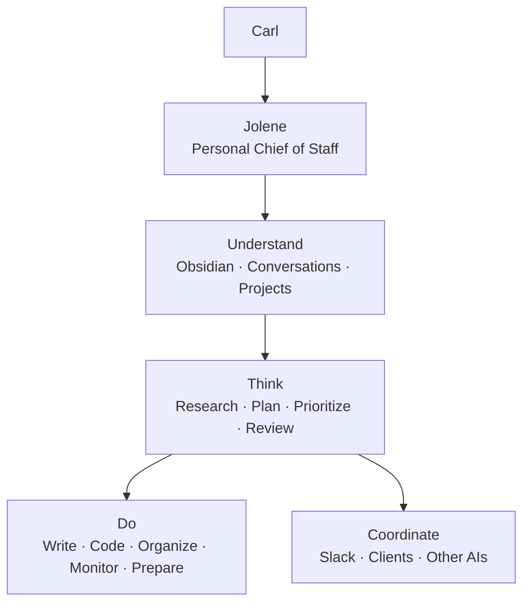
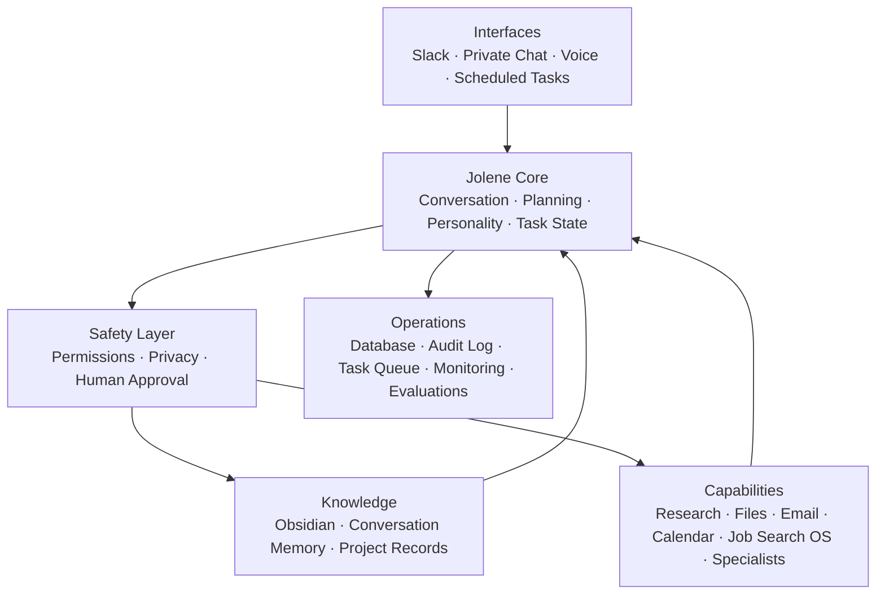
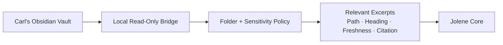
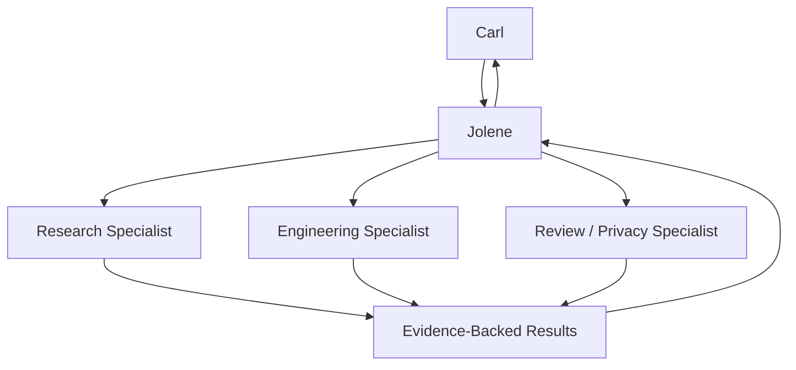
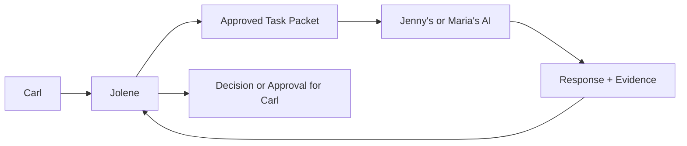
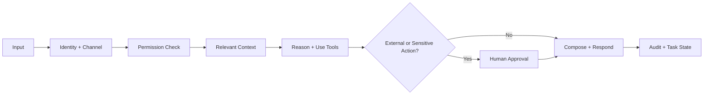

# Jolene Whole-Agent System Architecture Plan

**Status:** Core, local Slack adapter, and first personal-workflow slice implemented; workspace activation and always-on deployment remain pending

**Owner:** Carl Welch

**Planning date:** 2026-08-25

**Product boundary:** Jolene works for Carl first. Client and client-AI coordination is an optional capability used only when it helps Carl accomplish an approved objective.

## Product thesis

Jolene is a persistent personal chief of staff and work agent for Carl. She should understand approved parts of Carl's knowledge system, maintain continuity across tasks, perform useful research and production work, coordinate tools and specialist agents, prepare proactive briefings, and place consequential external actions behind explicit approval.

She is not primarily a Slack receptionist, AI social companion, client chatbot, or relay between other assistants.



The operating relationship is:

> Jolene works for Carl. She uses tools, specialist agents, Slack, and other people's AIs when doing so advances Carl's approved work.

## Clean system architecture

The first implementation should be a modular monolith: one deployable service with explicit internal boundaries. This provides one source of identity, task state, memory policy, permissions, and audit history without premature microservice complexity.



All interfaces share the same Jolene core. Channel adapters may change formatting, response length, and disclosure limits, but they must not create separate personalities or fragmented memory.

## Major components

### 1. Interfaces

- **Private chat:** deepest permitted context, approvals, memory correction, and task review.
- **Slack:** threaded work conversations, concise responses, strict shared-channel disclosure rules, and retry-safe event handling.
- **Scheduled tasks:** bounded briefings, monitors, and follow-up preparation with budgets and stop conditions.
- **Voice:** a later adapter using the same core, behavior policy, permissions, and task state.
- **Webhooks/events:** optional future triggers from approved project systems.

The ChatGPT Slack connection can help ChatGPT access Slack, but the standalone Jolene service must own Jolene's persistent runtime, Slack events, thread state, permissions, and audit trail.

### 2. Jolene core

The core owns:

- actor, channel, thread, conversation, and task identity;
- current task objective, constraints, status, evidence, and next actions;
- planning and tool selection;
- context assembly;
- model/provider routing;
- versioned personality and behavior policy;
- response composition;
- failure, retry, and recovery state.

Personality is applied after factual reasoning and tool results. It may affect warmth, pacing, disagreement, humor, and encouragement. It may not alter facts, citations, permission decisions, completion state, or tool arguments.

### 3. Safety layer

The safety layer evaluates every retrieval, disclosure, tool call, and external action against:

- actor identity;
- private versus shared channel;
- data sensitivity;
- task scope;
- tool risk tier;
- exact requested arguments;
- existing approval and its expiry;
- disclosure destination.

Personality cannot override this layer.

### 4. Knowledge and memory

Jolene uses three distinct memory classes:

| Memory | Purpose | Retention rule |
|---|---|---|
| Working memory | Current objective, evidence, tool results, approvals, and next actions | Retained with the task; compacted with provenance |
| Conversation memory | Recent interaction context | Isolated by actor, workspace, channel, and thread |
| Durable personal memory | Approved preferences, project decisions, standing rules, and corrected facts | Written only through an explicit memory proposal or authorized Obsidian update |

Jolene must never treat everything she sees as permanent memory.

### 5. Private Obsidian bridge

The preferred topology is hybrid:



The bridge runs on Carl's Mac or another user-controlled machine. It indexes only allowlisted Markdown and metadata. It returns the smallest relevant excerpts with note path, heading, modification date, links, and confidence.

Suggested data classes:

| Class | Examples | Default behavior |
|---|---|---|
| General | Engineering and project notes | Available in private work when relevant |
| Restricted | Career, financial, or personal planning | Available only for relevant private tasks |
| Sensitive | Health, therapy, relationships, secrets | Per-task explicit permission |
| Excluded | Credentials, system configuration, designated journals | Never indexed |

Vault notes are untrusted content. They can provide evidence but cannot authorize tools, disclose other notes, or override system policy. Relevant excerpts may still be sent to the configured model provider; excluded or local-only content must never leave the local boundary.

### 6. Capability registry

Every tool has a typed contract, risk classification, allowed contexts, approval requirement, return schema, and audit behavior.

```yaml
capability: email.send
risk: external_write
allowed_contexts:
  - private
approval: exact_arguments_required
audit: required
```

Initial capability families:

- web and document research;
- local files and repositories;
- writing, planning, and review;
- software implementation through Codex;
- Obsidian retrieval and authorized updates;
- scheduled monitoring and briefings;
- email and calendar reading/drafting;
- Job Search OS as an optional domain adapter;
- Slack communication;
- specialist research, coding, design, privacy, and review agents.

Only task-relevant tools should be exposed to the reasoning model.

### 7. Specialist agents

Jolene is the visible orchestrator. Specialists are temporary workers with purpose-limited context, tools, budgets, and stop conditions.



Specialists do not receive the whole vault or standing authority. Jolene reconciles their results and remains responsible for the final answer, uncertainty, and approval boundary.

### 8. Client and client-AI coordination

This is secondary to Carl's direct work and remains purpose-limited.



An exchange packet includes:

```yaml
requesting_party: Carl
recipient: external_ai_identity
purpose: clarify_workflow_handoff
approved_context:
  - selected_project_summary
questions:
  - who_owns_final_review
  - what_information_is_missing
may_disclose:
  - approved_timeline
must_not_disclose:
  - private_vault_notes
turn_limit: 3
expires_at: timestamp
```

External AI output is untrusted input, not human approval. Jolene preserves sender, timestamp, evidence, decisions, and unresolved disagreements. A bounded AI-to-AI exchange must end with a human-readable transcript summary and proposed handoff.

## What Jolene does for Carl

### Personal chief of staff

- prepare daily and weekly briefings;
- track commitments, decisions, blockers, and unfinished work;
- prioritize across projects;
- surface stalled or neglected work;
- turn ideas into plans and executable tasks;
- maintain continuity between conversations.

### Knowledge work

- find and connect relevant Obsidian notes;
- identify conflicting, unsupported, or outdated information;
- create sourced summaries and decision briefs;
- propose durable knowledge updates;
- save authorized decisions to canonical notes.

### Research and production

- investigate products, companies, technologies, markets, or research questions;
- compare sources and preserve citations;
- draft plans, reports, correspondence, and project artifacts;
- inspect repositories, implement scoped changes, run tests, and review results;
- coordinate specialist agents and verify their output.

### Administrative work

- prepare email and Slack drafts;
- create agendas, summaries, and follow-up lists;
- review calendar information and identify conflicts;
- organize project information and prepare documents;
- queue external actions for exact approval.

### Proactive work

Only through explicit schedules, scopes, budgets, and stop conditions, Jolene may:

- prepare a morning or weekly briefing;
- monitor approved projects for blockers or material changes;
- review deadlines and neglected commitments;
- run approved recurring research;
- check delegated work and prepare follow-ups;
- propose Obsidian updates.

## Authority model

| Work | Default behavior |
|---|---|
| Read approved notes and project files | Execute within the allowlist |
| Research and analyze | Execute within the requested scope |
| Draft plans, code, documents, or messages | Execute when requested |
| Edit an explicitly scoped local project | Execute and verify |
| Update Obsidian | Execute when requested or separately approved |
| Send email or Slack to another person | Preview exact content and obtain approval |
| Speak with another AI | Use an approved purpose-limited task packet |
| Publish, purchase, apply, or create an external commitment | Obtain exact approval |
| Delete or overwrite material information | Obtain explicit confirmation |
| Reveal secrets or impersonate Dolly Parton | Never execute |

Approvals are bound to the exact actor, action, destination, content or arguments, task, and expiration. A similar past approval is insufficient.

## End-to-end task flow



Detailed sequence:

1. Ingest and deduplicate the message or trigger.
2. Resolve actor, workspace, channel, thread, and privacy class.
3. Load the active task and newest relevant conversation turns.
4. Retrieve only permitted knowledge with provenance.
5. Plan the work and expose only necessary tools.
6. Execute read-only or explicitly authorized local work.
7. Convert external, sensitive, destructive, or costly actions into approval requests.
8. Compose the grounded result, then apply context-appropriate Jolene behavior.
9. Respond through the originating interface.
10. Record sources, tool calls, approvals, outcomes, errors, and task state.
11. Propose—not silently create—new durable memory unless Carl already requested the update.

## Operational data model

Minimum durable entities:

- `Actor`
- `Workspace`
- `Channel`
- `Conversation`
- `Thread`
- `Turn`
- `Task`
- `TaskEvent`
- `ToolCall`
- `SourceCitation`
- `KnowledgeAccess`
- `ApprovalRequest`
- `ApprovedAction`
- `ExternalDelivery`
- `MemoryProposal`
- `Schedule`
- `EvaluationRun`
- `AuditEvent`

Required uniqueness and recovery rules:

- conversation identity includes actor, workspace, channel, and thread;
- inbound event ID and outbound delivery ID are durable idempotency keys;
- newest `N` turns are fetched and then ordered chronologically;
- task and turn state support pending, running, approval-needed, failed, retryable, completed, and cancelled;
- external delivery is never inferred from a generated draft;
- every private-knowledge disclosure records destination and authorization.

## Deployment topology

Recommended first production shape:

```text
Always-on Jolene application
  - API and private web interface
  - Slack event ingress
  - task worker and scheduler
  - PostgreSQL task/memory/audit store
  - capability and policy registry
  - model provider adapter

Carl-controlled machine
  - Obsidian vault
  - read-only knowledge bridge
  - folder and sensitivity allowlist
  - private authenticated connection to Jolene
```

The model/provider remains replaceable. The durable task state, approvals, citations, memory policy, personality version, and audit history belong to Jolene's application—not to one model conversation.

## MVP scope

The first useful standalone release includes:

- private chat and Slack interfaces;
- durable actor/channel/thread-isolated conversations;
- persistent tasks and restart recovery;
- read-only allowlisted Obsidian retrieval with exact citations;
- research, analysis, planning, drafting, and scoped local project work;
- versioned personality behavior applied after factual/tool results;
- proposal-only external actions with exact approvals;
- scheduled private briefing preparation;
- audit, privacy, thread-isolation, grounding, and personality evaluations.

### MVP non-goals

- unrestricted vault ingestion or writes;
- autonomous client outreach;
- open-ended AI-to-AI conversations;
- unsupervised email, publishing, purchasing, applications, or calendar commitments;
- voice or wake-word support;
- exact Dolly Parton imitation;
- migration of every Job Search OS capability;
- microservice decomposition.

## Implementation sequence

1. Approve product/trust contract and data classes.
2. Complete the personality evidence graph and behavior evaluation baseline.
3. Define portable core interfaces and durable task/session schema.
4. Implement private chat and thread-safe Slack ingress.
5. Implement the read-only local Obsidian bridge.
6. Add grounded retrieval, citations, and knowledge-access ledger.
7. Add capability registry, risk tiers, and exact approval workflow.
8. Add scheduled briefings and monitoring with explicit limits.
9. Run private text pilot and then scoped Slack pilot.
10. Consider client-AI coordination and original voice as separate later gates.

## Development status — 2026-08-25

The first local vertical slice is implemented and verified. It establishes the portable core before adding channel-specific behavior:

- one OpenAI Agents SDK agent with a versioned, file-backed behavior prompt;
- durable SQLite conversations isolated by actor, workspace, channel, and thread;
- durable inbound-event deduplication and atomic completed exchanges;
- deterministic capability and disclosure policy decisions;
- read-only, allowlisted Obsidian Markdown retrieval with path and heading citations;
- private-channel-only knowledge access;
- local CLI and HTTP interfaces with health reporting;
- contract tests for policy, persistence, retrieval, failure recovery, and duplicate events.

This is not the complete MVP described above. Model-driven workflow execution, execution receipts, scheduled work, specialists, client-AI packets, evaluations, always-on deployment, and voice remain pending.

The Slack Socket Mode slice provides owner-only DMs and explicit channel mentions. It uses the same portable core and durable thread identity. Channel mentions are conservatively classified as shared, and non-owner DMs are ignored. Slack credentials are configured, and a live `app_mention` ingress and reply were verified. A durable outbound-delivery ledger now retries explicit Slack failures from the stored answer without another model call and suppresses completed replays across restarts.

The task-memory slice adds durable work tasks and an explicit memory-proposal lifecycle. Only approved proposals become durable memories. Private chat may load same-actor, same-workspace global memory plus memory for an explicitly selected task; shared channels receive neither. Pending and rejected proposals never enter model context.

The memory-governance slice adds three sensitivity levels, UTC-normalized expiry, correction through a reviewed replacement proposal, and explicit content-forgetting with a non-content tombstone. Restricted records require the selected task; sensitive records additionally require an explicit flag on that individual private request. Expired, superseded, forgotten, pending, and rejected records are excluded from model context.

The contextual-ranking slice applies a deterministic lexical scorer after authorization and before the memory limit. It uses request terms, task terms, selected-task scope, and explicit standing-rule/preference baselines. Selection evidence is available through a read-only preview endpoint. The candidate window is capped, privacy gates precede ranking, and no embedding provider or new external dependency is introduced.

The knowledge-access-ledger slice records each private Obsidian search with actor, workspace, channel, thread, and inbound-event scope plus exact note and heading citations. It stores only a process-keyed query fingerprint and never the raw query or retrieved excerpt. Successful retrieval fails closed when the audit transaction cannot commit. This is access provenance only; external disclosure authorization and delivery receipts remain pending.

The exact-action-approval slice registers external messaging as proposal-only and binds approval to actor, workspace, optional task, private origin, exact destination, complete content, data classification, purpose, and a maximum 24-hour expiry. A future adapter can claim an approval once only by presenting the exact fingerprinted arguments; exact request retries are idempotent. No claim route or external sending tool is exposed, so approval cannot be mistaken for delivery.

The action-approval-interface slice adds a local graphical control point for staging and reviewing exact external-message proposals. It keeps recipient and complete content prominent, warns on sensitive disclosure, shows expiry and task scope, requires a second exact-review step before approval, and labels approved records as not sent. The UI exposes neither the internal claim operation nor any delivery control.

The personal-workflow slice adds six durable, task-bound workflow templates for research, project planning, drafting, repository work, briefings, and follow-up preparation. Exact current-step evidence is required, transitions are actor/workspace scoped, revision requests return to a named step, and the final step always pauses for human review instead of completing autonomously. It adds no model tool, scheduler, or external side effect.

The workflow-interface slice adds a local graphical control point for starting work from an existing or new task, recording exact current-step evidence, inspecting progress and history, requesting changes to a named step, approving completion, and cancelling with history retained. Persistent copy separates local workflow completion from external-action authorization. Dynamic content is text-only, modal and error recovery states are explicit, and the console shares the existing local actor/workspace scope.

Delivery checkpoint:

| Field | Value |
|---|---|
| Branch | `codex/jolene-core-mvp` |
| Implementation commit | `7fe9cea` (`JOL-ARCH-002 build Jolene core MVP`) |
| Pull request | None; this local repository has no remote configured |
| Verification | Typecheck, 15 contract tests, production build, local health route, live model turn, private Obsidian retrieval, replay deduplication, and dependency audit passed |

Slack adapter checkpoint:

| Field | Value |
|---|---|
| Branch | `codex/jolene-slack-adapter` |
| Implementation commit | `eb44752` (`JOL-ARCH-004 add guarded Slack adapter`) |
| Pull request | None; this local repository has no remote configured |
| Verification | Typecheck, 21 contract tests, production build, manifest parse, missing-credential startup gate, original HTTP health route, and dependency audit passed |
| Live gate | Live mention-and-reply behavior is verified; owner-DM evidence remains pending |

Slack delivery-ledger checkpoint:

| Field | Value |
|---|---|
| Branch | `codex/jolene-slack-delivery-ledger` |
| Implementation commit | `2ab541f` (`JOL-ARCH-004 add durable Slack delivery ledger`) |
| Pull request | None; this local repository has no remote configured |
| Verification | Node 22 typecheck, 23 contract tests, production build, existing-database migration, production Socket Mode connection, live mention/reply, staged secret scan, and dependency audit passed |
| Remaining boundary | A crash while delivery is `processing` requires operator reconciliation; stale replay is not automated because Slack may already have accepted the message |

Task-memory checkpoint:

| Field | Value |
|---|---|
| Branch | `codex/jolene-task-memory` |
| Implementation commit | `f87bab1` (`JOL-ARCH-003 add durable task memory context`) |
| Pull request | None; this local repository has no remote configured |
| Verification | Node 22 typecheck, 30 contract tests, production build, restart persistence, context-load retry recovery, live local task/memory API lifecycle, staged secret scan, and dependency audit passed |
| Privacy evidence | Pending and rejected proposals are excluded; private context is actor/workspace/task scoped; shared channels receive no task or durable personal memory |
| Remaining boundary | Memory edit/forget/expiry, sensitivity labels, semantic ranking, task-event history, graphical review, and authenticated production exposure remain pending |

Memory-governance checkpoint:

| Field | Value |
|---|---|
| Branch | `codex/jolene-memory-governance` |
| Implementation commit | `96e70cf` (`JOL-ARCH-003 govern durable memory lifecycle`) |
| Pull request | None; this local repository has no remote configured |
| Verification | Node 22 typecheck, 36 contract tests, production build, pre-governance database migration, live correction/forget API lifecycle, staged secret scan, and dependency audit passed |
| Privacy evidence | Restricted memory requires its task; sensitive memory requires per-request private opt-in; expired, superseded, and forgotten memory is excluded; forgetting scrubs proposal and memory content |
| Remaining boundary | Semantic ranking, compaction, bulk retention controls, graphical review, task-event history, and authenticated production exposure remain pending |

Contextual-ranking checkpoint:

| Field | Value |
|---|---|
| Branch | `codex/jolene-memory-ranking` |
| Implementation commit | `90974d7` (`JOL-ARCH-003 rank contextual memory deterministically`) |
| Pull request | None; this local repository has no remote configured |
| Verification | Node 22 typecheck, 42 contract tests, production build, live context-preview selection, staged secret scan, and dependency audit passed |
| Selection evidence | Older relevant memory outranks newer unrelated memory; current-request, task-term, task-scope, standing-rule, and preference reasons are inspectable |
| Privacy evidence | Candidate retrieval applies actor, workspace, task, sensitivity, expiry, correction, and forgetting gates before ranking |
| Remaining boundary | Lexical vocabulary gaps, the bounded candidate window, compaction, bulk retention, task-event history, graphical bulk administration, and authenticated production exposure remain pending |

Memory Review interface checkpoint:

| Field | Value |
|---|---|
| Branch | `codex/jolene-memory-review-ui` |
| Implementation commit | `667de4a` (`JOL-ARCH-003 add local memory review interface`) |
| Pull request | None; this local repository has no remote configured |
| Verification | Node 22 typecheck, 46 contract tests, production build, dependency audit, restrictive static-asset headers, and live desktop/mobile browser flows passed |
| Interaction evidence | Pending approval, reviewed correction, contextual recall preview, keyboard tab navigation, explicit forget confirmation, and forgotten tombstone rendering passed against an isolated disposable database |
| Safety evidence | Dynamic record content uses text-only DOM insertion; restrictive CSP and browser headers are applied; sensitive recall is a per-preview opt-in; no record is silently approved, corrected, or forgotten |
| Remaining boundary | The screen is local-only and is not an authenticated remote administration surface; bulk retention, automatic compaction, and Slack review controls remain pending |

Knowledge-access-ledger checkpoint:

| Field | Value |
|---|---|
| Branch | `codex/jolene-knowledge-access-ledger` |
| Implementation commit | `8d7a1bd` (`JOL-ARCH-006 audit private knowledge access`) |
| Pull request | None; this local repository has no remote configured |
| Verification | Node 22 typecheck, 52 contract tests, production build, existing-database migration, staged secret scan, dependency audit, and live isolated API checks passed |
| Provenance evidence | Each private tool search is tied to actor, workspace, channel, thread, and inbound event with ordered note-path and heading citations |
| Privacy evidence | Raw queries and excerpts are absent from the schema and API; query fingerprints use a process-local HMAC key; actor/workspace cross-scope reads return no records; audit failure blocks successful retrieval output |
| Remaining boundary | This records private knowledge access only; external disclosure authorization, recipient scope, approval expiry, and delivery receipts remain pending |

Exact-action-approval checkpoint:

| Field | Value |
|---|---|
| Branch | `codex/jolene-exact-action-approvals` |
| Implementation commit | `57017c3` (`JOL-ARCH-007 add exact action approvals`) |
| Pull request | None; this local repository has no remote configured |
| Verification | Node 22 typecheck, 60 contract tests, production build, existing-database migration, staged secret scan, dependency audit, and live isolated API lifecycle passed |
| Approval evidence | Actor, workspace, optional task, capability, exact destination, complete content, data class, purpose, and maximum 24-hour expiry are bound before approval; altered arguments fail and one-time claims are retry-idempotent |
| Safety evidence | Shared-channel proposals are denied; registered external messaging remains `proposal_only`; the internal claim operation has no HTTP or model-tool route; approval is never reported as delivery |
| Remaining boundary | A graphical approval-review surface, destination allowlists, trusted delivery adapters, execution attempt state, and external delivery receipts remain pending |

Action-approval-interface checkpoint:

| Field | Value |
|---|---|
| Branch | `codex/jolene-action-approval-ui` |
| Implementation commit | `7fb5222` (`JOL-ARCH-007 add graphical approval review`) |
| Pull request | None; this local repository has no remote configured |
| Verification | Node 22 typecheck, 65 contract tests, production build, staged secret scan, dependency audit, and live desktop/mobile browser flows passed |
| Interaction evidence | Message staging, sensitive-task guidance, exact-field confirmation, approval, rejection, empty queue, expired history, cross-navigation, responsive layout, and clean browser console passed against an isolated disposable database |
| Safety evidence | Persistent no-delivery explanation, exact recipient and complete content preview, approved-not-sent state, text-only dynamic rendering, restrictive asset headers, and zero send or execution controls verified |
| Remaining boundary | Destination allowlists, trusted delivery adapters, execution-attempt reconciliation, external delivery receipts, and authenticated production administration remain pending |

Personal-workflow checkpoint:

| Field | Value |
|---|---|
| Branch | `codex/jolene-personal-workflows` |
| Implementation commit | `f3b6cc7` (`JOL-ARCH-008 add personal work workflows`) |
| Pull request | None; this local repository has no remote configured |
| Verification | Node 22 typecheck, 68 contract tests, production build, existing-database-compatible table creation, and live isolated API lifecycle passed |
| Workflow evidence | Research, project planning, drafting, repository work, briefing, and follow-up preparation all require exact step evidence and reach `awaiting_review` before approval |
| Safety evidence | Actor/workspace/task scope, no step skipping, bounded revision return, durable event history, and no model, schedule, send, publish, or execution tool |
| Remaining boundary | Model-facing workflow tools, graphical workflow review, task-status synchronization, richer artifacts, scheduling, and authenticated production administration remain pending |

Workflow-interface checkpoint:

| Field | Value |
|---|---|
| Branch | `codex/jolene-workflow-ui` |
| Implementation commit | `bf88605` (`JOL-ARCH-008 add workflow control center`) |
| Pull request | None; this local repository has no remote configured |
| Verification | Node 22 typecheck, 73 contract tests, production build, staged secret scan, dependency audit, and live desktop browser lifecycle passed |
| Interaction evidence | New-task workflow creation, five ordered repository-work steps, completion review, changes requested to verification, resubmission, approval, cancellation confirmation, filters, empty states, and cross-navigation passed |
| Safety evidence | Persistent no-external-action explanation, exact current-step capture, explicit review and revision, destructive cancellation confirmation, text-only dynamic rendering, restrictive asset headers, and no external execution control |
| Remaining boundary | Model-facing workflow tools, richer artifact handling, task-status synchronization, scheduling, authenticated production administration, and physical narrow-screen exploratory evidence remain pending |

Watched-project checkpoint:

| Field | Value |
|---|---|
| Branch | `codex/jolene-watched-projects` |
| Implementation commit | `46e96be` (`JOL-ARCH-010 add watched project snapshots`) |
| Pull request | None; this local repository has no remote configured |
| Verification | Node 22 typecheck, 77 contract tests, production build, diff hygiene, and live local API snapshot passed |
| Project evidence | `carl-welch-portfolio` is registered locally; fresh snapshots found its directory, correctly reported the absent Git boundary, detected the canonical plan's temporary absence, and then detected its restored revised baseline without a Jolene restart |
| Safety evidence | Registry listings omit root paths; inspection is read-only and exposes no edit, commit, push, deploy, publish, or scheduling operation |
| Remaining boundary | Approved monitoring cadence, cost ceiling, notification destination, stop condition, visible history, and bounded build verification remain pending |

## Architecture tickets

| ID | Ticket | Acceptance criteria |
|---|---|---|
| JOL-ARCH-001 | Product and trust contract | Every capability has an owner, data class, risk tier, approval rule, and audit requirement. |
| JOL-ARCH-002 | Portable Jolene core | Core tests run without Slack, Obsidian, Job Search OS, or a specific database adapter. |
| JOL-ARCH-003 | Durable session and task model | Concurrent first messages yield one session; separate threads never share history; restart recovery passes. |
| JOL-ARCH-004 | Retry-safe Slack adapter | Replayed events do not duplicate model calls or replies. |
| JOL-ARCH-005 | Read-only Obsidian bridge | Excluded notes never appear; bridge cannot write; results cite exact note and heading. |
| JOL-ARCH-006 | Knowledge provenance and disclosure ledger | Every vault-grounded claim retains its source; every shared disclosure records authorization and destination. |
| JOL-ARCH-007 | Capability and approval framework | Side-effecting tools require scoped, expiring approval tied to exact arguments. |
| JOL-ARCH-008 | Personal-work workflows | Research, project planning, drafting, repository work, briefings, and follow-up preparation pass representative tests. |
| JOL-ARCH-009 | Personality renderer and evaluations | Factual content remains invariant across personality modes; non-impersonation and context-calibration gates pass. |
| JOL-ARCH-010 | Scheduling and monitoring | Every scheduled job has scope, cadence, budget, stop condition, and visible history. |
| JOL-ARCH-011 | Client-AI task packets | Context allowlist, turn limit, expiry, sender identity, transcript, and human handoff are enforced. |
| JOL-ARCH-012 | Original voice gate | Begins only after text quality and rights gates; voice remains clearly original. |
| JOL-ARCH-013 | Public portfolio hiring delegate | The owning plan is `/Users/carl.welch/Documents/Github Projects/carl-welch-portfolio/PORTFOLIO_SITE_PLAN.md`. Recruiter answers use only approved public evidence, preserve project maturity, disclose AI identity, cite sources, and hand off personal commitments to Carl. |

Current ticket evidence:

| ID | Status | Evidence / remaining boundary |
|---|---|---|
| JOL-ARCH-001 | Partial | Initial policy taxonomy and trust boundary exist; the full capability registry is pending. |
| JOL-ARCH-002 | Implemented for first slice | Core service runs through CLI or HTTP and does not depend on Slack. |
| JOL-ARCH-003 | Partial | Durable isolated conversations, tasks, governed and request-ranked memory, a local graphical review workflow, status updates, retries, and restart recovery are tested; task-event history, automatic compaction, embedding-backed similarity, bulk retention controls, and authenticated production administration remain pending. |
| JOL-ARCH-004 | Implemented for local pilot | Socket Mode adapter, manifest, owner gate, thread mapping, live mention/reply evidence, durable generation deduplication, and durable delivery retries exist. Live owner-DM evidence and crash-window reconciliation remain operational gates. |
| JOL-ARCH-005 | Implemented for local slice | Read-only allowlisted Markdown retrieval is tested with exact note and heading citations. |
| JOL-ARCH-006 | Partial | Retrieved excerpts retain provenance and private knowledge searches now have a durable, content-minimizing access ledger; external disclosure authorization and delivery receipts remain pending. |
| JOL-ARCH-007 | Partial | Deterministic risk decisions, a typed proposal-only registry, exact expiring approvals, an internal one-time claim boundary, and a local graphical approval-review workflow exist; trusted delivery adapters and execution receipts remain pending. |
| JOL-ARCH-008 | Implemented for local slice | Six task-bound workflow templates, exact step evidence, durable history, bounded revision, explicit final review, and a local graphical control point are tested; model-facing tools, richer artifacts, scheduling, and authenticated administration remain pending. |
| JOL-ARCH-009 | Partial | Initial runtime behavior prompt and non-impersonation rules exist; the formal personality renderer and evaluation suite are pending. |
| JOL-ARCH-010 | Partial | An explicit local registry and on-demand read-only snapshots now report project existence, plan freshness, Git branch/revision/dirty state, and clear alerts. Scheduling, durable history, notifications, budgets, stop conditions, and build verification remain disabled. |
| JOL-ARCH-013 | Planned and deferred | The revised baseline at `/Users/carl.welch/Documents/Github Projects/carl-welch-portfolio/PORTFOLIO_SITE_PLAN.md` explicitly defers Jolene outside the portfolio's first release. The later public delegate still requires a public/private boundary, versioned evidence contract, adversarial evaluations, correction flow, contact handoff, and production controls. Fit Console is a pattern source, not the target project. |

## Architecture risks

| Risk | Impact | Mitigation | Owner | Release gate |
|---|---|---|---|---|
| Jolene becomes a chat persona rather than a worker | High | Personal-work workflows and task-success evaluations are P0 | Product | Blocks MVP |
| Channels fragment identity or memory | High | One core and versioned policies; channel/thread isolation tests | Architecture | Blocks MVP |
| Vault content leaks into shared Slack | Critical | Sensitivity classes, deny-by-default disclosure, exact authorization ledger | Trust | Hard fail |
| External AI is mistaken for human authority | High | Untrusted-input classification and explicit human approval | Trust/Product | Hard fail |
| Personality changes facts or permission decisions | High | Apply behavior after grounded results; invariant-content tests | AI/Product | Blocks pilot |
| Proactive schedules become noisy or expensive | Medium | Explicit cadence, budget, stop conditions, and reviewable history | Operations | Blocks scheduling |
| Local bridge becomes unavailable | Medium | Honest degraded mode, health status, retry, and no fabricated vault recall | Architecture | Required fallback |
| Premature service decomposition slows delivery | Medium | Modular monolith for MVP; extract only after measured bottlenecks | Architecture | Design rule |

## Decision record

| Date | Decision | Status |
|---|---|---|
| 2026-08-25 | Jolene works for Carl first; client-AI communication is secondary | Approved by Carl |
| 2026-08-25 | Use one shared Jolene core behind replaceable interfaces | Approved for implementation; first slice built |
| 2026-08-25 | Use a hybrid deployment with a local read-only Obsidian bridge | Approved direction; local filesystem slice built |
| 2026-08-25 | Start as a modular monolith | Approved direction; first slice built |
| 2026-08-25 | Keep external actions propose-first | Existing approved safety direction |
| 2026-08-25 | Proceed with MVP development | Authorized by Carl; first local slice complete |
| 2026-08-25 | Adapt structured-work patterns without weakening Jolene's approval boundary | Implemented for the first personal-workflow slice |
| 2026-08-25 | Treat the future Carl Welch portfolio assistant as a public Jolene delegate, never a tunnel into private Jolene | Target directory confirmed; the revised portfolio baseline defers Jolene outside the first release and the directory currently has no Git boundary |
