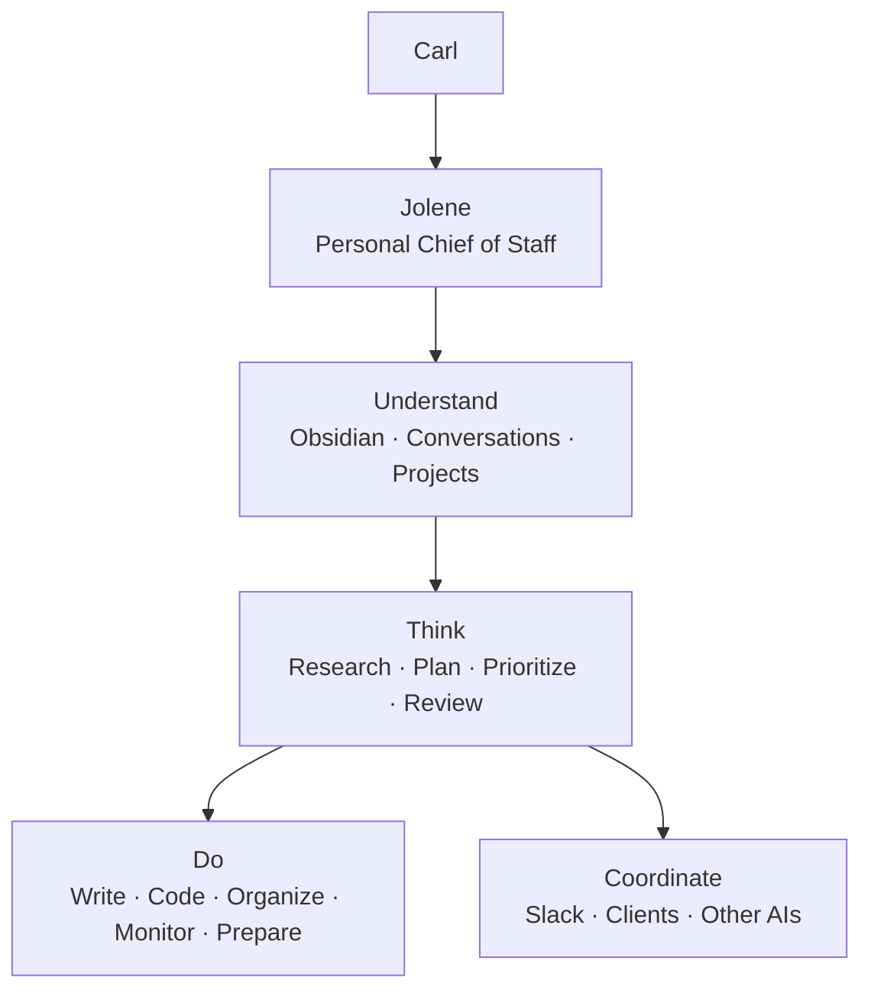
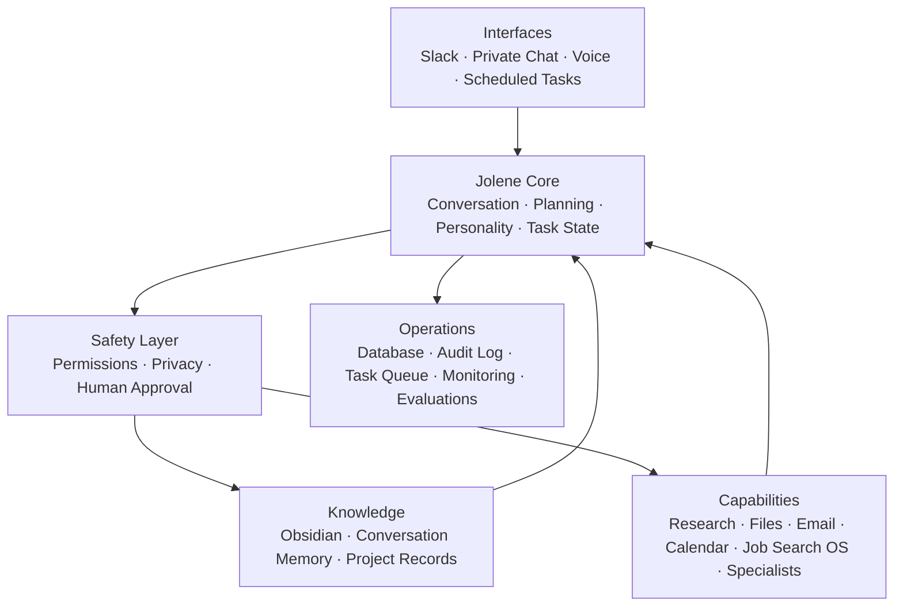
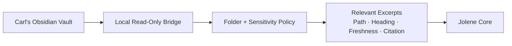
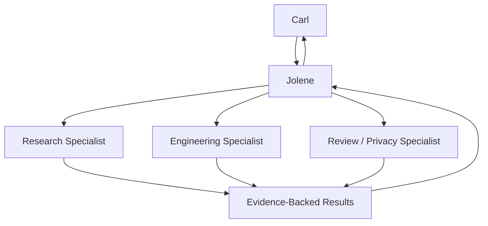
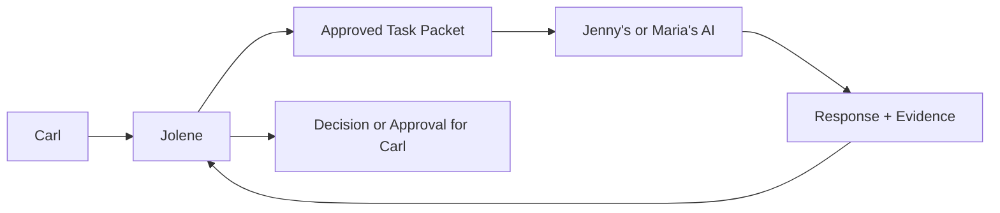
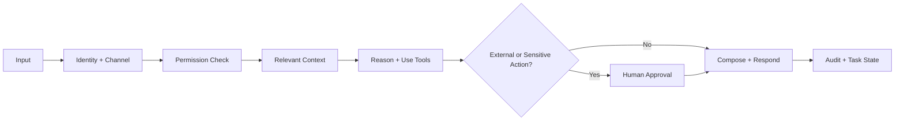

# Jolene Whole-Agent System Architecture Plan

**Status:** Core, local Slack adapter, and first personal-workflow slice implemented; workspace activation and always-on deployment remain pending

**Owner:** Carl Welch

**Planning date:** 2026-08-25

**Product boundary:** Jolene works for Carl first. Client and client-AI coordination is an optional capability used only when it helps Carl accomplish an approved objective.

## Product thesis

Jolene is a persistent personal chief of staff and work agent for Carl. She should understand approved parts of Carl's knowledge system, maintain continuity across tasks, perform useful research and production work, coordinate tools and specialist agents, prepare proactive briefings, and place consequential external actions behind explicit approval.

She is not primarily a Slack receptionist, AI social companion, client chatbot, or relay between other assistants.



The operating relationship is:

> Jolene works for Carl. She uses tools, specialist agents, Slack, and other people's AIs when doing so advances Carl's approved work.

## Clean system architecture

The first implementation should be a modular monolith: one deployable service with explicit internal boundaries. This provides one source of identity, task state, memory policy, permissions, and audit history without premature microservice complexity.



All interfaces share the same Jolene core. Channel adapters may change formatting, response length, and disclosure limits, but they must not create separate personalities or fragmented memory.

## Major components

### 1. Interfaces

- **Private chat:** deepest permitted context, approvals, memory correction, and task review.
- **Slack:** threaded work conversations, concise responses, strict shared-channel disclosure rules, and retry-safe event handling.
- **Scheduled tasks:** bounded briefings, monitors, and follow-up preparation with budgets and stop conditions.
- **Voice:** a later adapter using the same core, behavior policy, permissions, and task state.
- **Webhooks/events:** optional future triggers from approved project systems.

The ChatGPT Slack connection can help ChatGPT access Slack, but the standalone Jolene service must own Jolene's persistent runtime, Slack events, thread state, permissions, and audit trail.

### 2. Jolene core

The core owns:

- actor, channel, thread, conversation, and task identity;
- current task objective, constraints, status, evidence, and next actions;
- planning and tool selection;
- context assembly;
- model/provider routing;
- versioned personality and behavior policy;
- response composition;
- failure, retry, and recovery state.

Personality is applied after factual reasoning and tool results. It may affect warmth, pacing, disagreement, humor, and encouragement. It may not alter facts, citations, permission decisions, completion state, or tool arguments.

### 3. Safety layer

The safety layer evaluates every retrieval, disclosure, tool call, and external action against:

- actor identity;
- private versus shared channel;
- data sensitivity;
- task scope;
- tool risk tier;
- exact requested arguments;
- existing approval and its expiry;
- disclosure destination.

Personality cannot override this layer.

### 4. Knowledge and memory

Jolene uses three distinct memory classes:

| Memory | Purpose | Retention rule |
|---|---|---|
| Working memory | Current objective, evidence, tool results, approvals, and next actions | Retained with the task; compacted with provenance |
| Conversation memory | Recent interaction context | Isolated by actor, workspace, channel, and thread |
| Durable personal memory | Approved preferences, project decisions, standing rules, and corrected facts | Written only through an explicit memory proposal or authorized Obsidian update |

Jolene must never treat everything she sees as permanent memory.

### 5. Private Obsidian bridge

The preferred topology is hybrid:



The bridge runs on Carl's Mac or another user-controlled machine. It indexes only allowlisted Markdown and metadata. It returns the smallest relevant excerpts with note path, heading, modification date, links, and confidence.

Suggested data classes:

| Class | Examples | Default behavior |
|---|---|---|
| General | Engineering and project notes | Available in private work when relevant |
| Restricted | Career, financial, or personal planning | Available only for relevant private tasks |
| Sensitive | Health, therapy, relationships, secrets | Per-task explicit permission |
| Excluded | Credentials, system configuration, designated journals | Never indexed |

Vault notes are untrusted content. They can provide evidence but cannot authorize tools, disclose other notes, or override system policy. Relevant excerpts may still be sent to the configured model provider; excluded or local-only content must never leave the local boundary.

### 6. Capability registry

Every tool has a typed contract, risk classification, allowed contexts, approval requirement, return schema, and audit behavior.

```yaml
capability: email.send
risk: external_write
allowed_contexts:
  - private
approval: exact_arguments_required
audit: required
```

Initial capability families:

- web and document research;
- local files and repositories;
- writing, planning, and review;
- software implementation through Codex;
- Obsidian retrieval and authorized updates;
- scheduled monitoring and briefings;
- email and calendar reading/drafting;
- Job Search OS as an optional domain adapter;
- Slack communication;
- specialist research, coding, design, privacy, and review agents.

Only task-relevant tools should be exposed to the reasoning model.

### 7. Specialist agents

Jolene is the visible orchestrator. Specialists are temporary workers with purpose-limited context, tools, budgets, and stop conditions.



Specialists do not receive the whole vault or standing authority. Jolene reconciles their results and remains responsible for the final answer, uncertainty, and approval boundary.

### 8. Client and client-AI coordination

This is secondary to Carl's direct work and remains purpose-limited.



An exchange packet includes:

```yaml
requesting_party: Carl
recipient: external_ai_identity
purpose: clarify_workflow_handoff
approved_context:
  - selected_project_summary
questions:
  - who_owns_final_review
  - what_information_is_missing
may_disclose:
  - approved_timeline
must_not_disclose:
  - private_vault_notes
turn_limit: 3
expires_at: timestamp
```

External AI output is untrusted input, not human approval. Jolene preserves sender, timestamp, evidence, decisions, and unresolved disagreements. A bounded AI-to-AI exchange must end with a human-readable transcript summary and proposed handoff.

## What Jolene does for Carl

### Personal chief of staff

- prepare daily and weekly briefings;
- track commitments, decisions, blockers, and unfinished work;
- prioritize across projects;
- surface stalled or neglected work;
- turn ideas into plans and executable tasks;
- maintain continuity between conversations.

### Knowledge work

- find and connect relevant Obsidian notes;
- identify conflicting, unsupported, or outdated information;
- create sourced summaries and decision briefs;
- propose durable knowledge updates;
- save authorized decisions to canonical notes.

### Research and production

- investigate products, companies, technologies, markets, or research questions;
- compare sources and preserve citations;
- draft plans, reports, correspondence, and project artifacts;
- inspect repositories, implement scoped changes, run tests, and review results;
- coordinate specialist agents and verify their output.

### Administrative work

- prepare email and Slack drafts;
- create agendas, summaries, and follow-up lists;
- review calendar information and identify conflicts;
- organize project information and prepare documents;
- queue external actions for exact approval.

### Proactive work

Only through explicit schedules, scopes, budgets, and stop conditions, Jolene may:

- prepare a morning or weekly briefing;
- monitor approved projects for blockers or material changes;
- review deadlines and neglected commitments;
- run approved recurring research;
- check delegated work and prepare follow-ups;
- propose Obsidian updates.

## Authority model

| Work | Default behavior |
|---|---|
| Read approved notes and project files | Execute within the allowlist |
| Research and analyze | Execute within the requested scope |
| Draft plans, code, documents, or messages | Execute when requested |
| Edit an explicitly scoped local project | Execute and verify |
| Update Obsidian | Execute when requested or separately approved |
| Send email or Slack to another person | Preview exact content and obtain approval |
| Speak with another AI | Use an approved purpose-limited task packet |
| Publish, purchase, apply, or create an external commitment | Obtain exact approval |
| Delete or overwrite material information | Obtain explicit confirmation |
| Reveal secrets or impersonate Dolly Parton | Never execute |

Approvals are bound to the exact actor, action, destination, content or arguments, task, and expiration. A similar past approval is insufficient.

## End-to-end task flow



Detailed sequence:

1. Ingest and deduplicate the message or trigger.
2. Resolve actor, workspace, channel, thread, and privacy class.
3. Load the active task and newest relevant conversation turns.
4. Retrieve only permitted knowledge with provenance.
5. Plan the work and expose only necessary tools.
6. Execute read-only or explicitly authorized local work.
7. Convert external, sensitive, destructive, or costly actions into approval requests.
8. Compose the grounded result, then apply context-appropriate Jolene behavior.
9. Respond through the originating interface.
10. Record sources, tool calls, approvals, outcomes, errors, and task state.
11. Propose—not silently create—new durable memory unless Carl already requested the update.

## Operational data model

Minimum durable entities:

- `Actor`
- `Workspace`
- `Channel`
- `Conversation`
- `Thread`
- `Turn`
- `Task`
- `TaskEvent`
- `ToolCall`
- `SourceCitation`
- `KnowledgeAccess`
- `ApprovalRequest`
- `ApprovedAction`
- `ExternalDelivery`
- `MemoryProposal`
- `Schedule`
- `EvaluationRun`
- `AuditEvent`

Required uniqueness and recovery rules:

- conversation identity includes actor, workspace, channel, and thread;
- inbound event ID and outbound delivery ID are durable idempotency keys;
- newest `N` turns are fetched and then ordered chronologically;
- task and turn state support pending, running, approval-needed, failed, retryable, completed, and cancelled;
- external delivery is never inferred from a generated draft;
- every private-knowledge disclosure records destination and authorization.

## Deployment topology

Recommended first production shape:

```text
Always-on Jolene application
  - API and private web interface
  - Slack event ingress
  - task worker and scheduler
  - PostgreSQL task/memory/audit store
  - capability and policy registry
  - model provider adapter

Carl-controlled machine
  - Obsidian vault
  - read-only knowledge bridge
  - folder and sensitivity allowlist
  - private authenticated connection to Jolene
```

The model/provider remains replaceable. The durable task state, approvals, citations, memory policy, personality version, and audit history belong to Jolene's application—not to one model conversation.

## MVP scope

The first useful standalone release includes:

- private chat and Slack interfaces;
- durable actor/channel/thread-isolated conversations;
- persistent tasks and restart recovery;
- read-only allowlisted Obsidian retrieval with exact citations;
- research, analysis, planning, drafting, and scoped local project work;
- versioned personality behavior applied after factual/tool results;
- proposal-only external actions with exact approvals;
- scheduled private briefing preparation;
- audit, privacy, thread-isolation, grounding, and personality evaluations.

### MVP non-goals

- unrestricted vault ingestion or writes;
- autonomous client outreach;
- open-ended AI-to-AI conversations;
- unsupervised email, publishing, purchasing, applications, or calendar commitments;
- voice or wake-word support;
- exact Dolly Parton imitation;
- migration of every Job Search OS capability;
- microservice decomposition.

## Implementation sequence

1. Approve product/trust contract and data classes.
2. Complete the personality evidence graph and behavior evaluation baseline.
3. Define portable core interfaces and durable task/session schema.
4. Implement private chat and thread-safe Slack ingress.
5. Implement the read-only local Obsidian bridge.
6. Add grounded retrieval, citations, and knowledge-access ledger.
7. Add capability registry, risk tiers, and exact approval workflow.
8. Add scheduled briefings and monitoring with explicit limits.
9. Run private text pilot and then scoped Slack pilot.
10. Consider client-AI coordination and original voice as separate later gates.

## Development status — 2026-08-25

The first local vertical slice is implemented and verified. It establishes the portable core before adding channel-specific behavior:

- one OpenAI Agents SDK agent with a versioned, file-backed behavior prompt;
- durable SQLite conversations isolated by actor, workspace, channel, and thread;
- durable inbound-event deduplication and atomic completed exchanges;
- deterministic capability and disclosure policy decisions;
- read-only, allowlisted Obsidian Markdown retrieval with path and heading citations;
- private-channel-only knowledge access;
- local CLI and HTTP interfaces with health reporting;
- contract tests for policy, persistence, retrieval, failure recovery, and duplicate events.

This is not the complete MVP described above. Model-driven workflow execution, execution receipts, general scheduled work, specialists, client-AI transport and autonomous exchanges, evaluations, always-on deployment, and voice remain pending. The durable review-only client-AI packet lifecycle is implemented locally.

The Slack Socket Mode slice provides owner-only DMs and explicit channel mentions. It uses the same portable core and durable thread identity. Channel mentions are conservatively classified as shared, and non-owner DMs are ignored. Slack credentials are configured, and a live `app_mention` ingress and reply were verified. A durable outbound-delivery ledger now retries explicit Slack failures from the stored answer without another model call and suppresses completed replays across restarts.

The task-memory slice adds durable work tasks and an explicit memory-proposal lifecycle. Only approved proposals become durable memories. Private chat may load same-actor, same-workspace global memory plus memory for an explicitly selected task; shared channels receive neither. Pending and rejected proposals never enter model context.

The task-event slice adds a durable timeline for created tasks, status
transitions, progress, evidence, decisions, blockers, and next actions. Task
creation and status events are transactional; repeated status updates are
idempotent. Private model context receives only a bounded chronological window
from the explicitly selected actor/workspace-owned task. Events are historical
context, not executable instructions or proof of an external outcome.

The task-timeline-interface slice adds that history to the existing local
Memory Review information architecture. An owner can switch among scoped tasks,
inspect objective, status, and newest-first history, and append factual manual
events. Persistent boundary copy separates task continuity from authorization
or external-action receipts. The interface covers loading, no-task, empty,
error, disabled, success, keyboard, reduced-motion, desktop, and narrow-screen
states without adding deletion, scheduling, status mutation, public exposure,
or remote administration.

The relevance-aware-task-recall slice keeps a bounded recent continuity window
while recovering older selected-task events whose summary or details match the
current private request. Selection is deterministic, provider-independent, and
inspectable through Context Preview; final events return to chronological order
before entering the prompt. The candidate window remains bounded and all
existing actor, workspace, selected-task, and private-channel gates run before
ranking. Timeline review remains chronological and unchanged.

The memory-governance slice adds three sensitivity levels, UTC-normalized expiry, correction through a reviewed replacement proposal, and explicit content-forgetting with a non-content tombstone. Restricted records require the selected task; sensitive records additionally require an explicit flag on that individual private request. Expired, superseded, forgotten, pending, and rejected records are excluded from model context.

The contextual-ranking slice applies a deterministic lexical scorer after authorization and before the memory limit. It uses request terms, task terms, selected-task scope, and explicit standing-rule/preference baselines. Selection evidence is available through a read-only preview endpoint. The candidate window is capped, privacy gates precede ranking, and no embedding provider or new external dependency is introduced.

The knowledge-access-ledger slice records each private Obsidian search with actor, workspace, channel, thread, and inbound-event scope plus exact note and heading citations. It stores only a process-keyed query fingerprint and never the raw query or retrieved excerpt. Successful retrieval fails closed when the audit transaction cannot commit. This is access provenance only; external disclosure authorization and delivery receipts remain pending.

The private capability-registry slice inventories the five current read-only
model tools plus the inert external-message proposal boundary with stable owner,
data-class, risk, context, approval, runtime, input/output-contract, and audit
metadata. Private model tool names and shared-channel denial now resolve through
that registry. Every attempted model-tool execution adds a durable record with
only event, actor, workspace, capability, tool, fixed outcome, and timestamp;
successful private results fail closed if the record cannot commit.

The exact-action-approval slice registers external messaging as proposal-only and binds approval to actor, workspace, optional task, private origin, exact destination, complete content, data classification, purpose, and a maximum 24-hour expiry. A future adapter can claim an approval once only by presenting the exact fingerprinted arguments; exact request retries are idempotent. No claim route or external sending tool is exposed, so approval cannot be mistaken for delivery.

The action-approval-interface slice adds a local graphical control point for staging and reviewing exact external-message proposals. It keeps recipient and complete content prominent, warns on sensitive disclosure, shows expiry and task scope, requires a second exact-review step before approval, and labels approved records as not sent. The UI exposes neither the internal claim operation nor any delivery control.

The personal-workflow slice adds six durable, task-bound workflow templates for research, project planning, drafting, repository work, briefings, and follow-up preparation. Exact current-step evidence is required, transitions are actor/workspace scoped, revision requests return to a named step, and the final step always pauses for human review instead of completing autonomously. It adds no model tool, scheduler, or external side effect.

The workflow-interface slice adds a local graphical control point for starting work from an existing or new task, recording exact current-step evidence, inspecting progress and history, requesting changes to a named step, approving completion, and cancelling with history retained. Persistent copy separates local workflow completion from external-action authorization. Dynamic content is text-only, modal and error recovery states are explicit, and the console shares the existing local actor/workspace scope.

Delivery checkpoint:

| Field | Value |
|---|---|
| Branch | `codex/jolene-core-mvp` |
| Implementation commit | `7fe9cea` (`JOL-ARCH-002 build Jolene core MVP`) |
| Pull request | None; this local repository has no remote configured |
| Verification | Typecheck, 15 contract tests, production build, local health route, live model turn, private Obsidian retrieval, replay deduplication, and dependency audit passed |

Private capability-registry checkpoint:

| Field | Value |
|---|---|
| Asana | [JOL-ARCH-001A](https://app.asana.com/1/9789386902387/project/1216473233375594/task/1217891589216822) |
| Branch | `codex/jol-arch-001a-capability-registry` |
| Implementation commit | `793fc95` (`JOL-ARCH-001A complete private capability registry`) |
| Inventory | Five current private read-only model tools and one proposal-only external-message capability; no new authority or execution |
| Contract | Immutable definitions bind Carl as owner, data classes, risk, private context, approval, runtime, model tool name, versioned input/output contract, and audit mechanisms |
| Enforcement | Exact model exposure derives from registry policy plus existing career/work/project availability; shared channels resolve to no private model tools |
| Audit | Durable event/actor/workspace/capability/tool/outcome/time only; no inputs, outputs, exceptions, channels, threads, paths, credentials, or provider details; successful access fails closed on audit failure |
| Verification | Node 24: 70 test files / 403 tests; typecheck; production build; zero-vulnerability production dependency audit; private/tools and public Compose validation; frozen public suite 41/41 with 24/24 blocker metrics; fresh image manifest `sha256:e31d7346cfbd71732ce8710125628431bef0fefbfd7d0dfe5ea9151d5e5cac1e`; disposable compiled HTTP runtime returned six immutable registry entries, five exact model tool names, an empty scoped invocation ledger, and `400` for missing actor scope |
| Remaining boundary | Local admin APIs, workers, public delegate operations, future integrations, specialist tools, remote administration, and trusted delivery/execution remain outside this inventory |

Slack adapter checkpoint:

| Field | Value |
|---|---|
| Branch | `codex/jolene-slack-adapter` |
| Implementation commit | `eb44752` (`JOL-ARCH-004 add guarded Slack adapter`) |
| Pull request | None; this local repository has no remote configured |
| Verification | Typecheck, 21 contract tests, production build, manifest parse, missing-credential startup gate, original HTTP health route, and dependency audit passed |
| Live gate | Live mention-and-reply behavior is verified; owner-DM evidence remains pending |

Slack delivery-ledger checkpoint:

| Field | Value |
|---|---|
| Branch | `codex/jolene-slack-delivery-ledger` |
| Implementation commit | `2ab541f` (`JOL-ARCH-004 add durable Slack delivery ledger`) |
| Pull request | None; this local repository has no remote configured |
| Verification | Node 22 typecheck, 23 contract tests, production build, existing-database migration, production Socket Mode connection, live mention/reply, staged secret scan, and dependency audit passed |
| Remaining boundary | A crash while delivery is `processing` requires operator reconciliation; stale replay is not automated because Slack may already have accepted the message |

Task-memory checkpoint:

| Field | Value |
|---|---|
| Branch | `codex/jolene-task-memory` |
| Implementation commit | `f87bab1` (`JOL-ARCH-003 add durable task memory context`) |
| Pull request | None; this local repository has no remote configured |
| Verification | Node 22 typecheck, 30 contract tests, production build, restart persistence, context-load retry recovery, live local task/memory API lifecycle, staged secret scan, and dependency audit passed |
| Privacy evidence | Pending and rejected proposals are excluded; private context is actor/workspace/task scoped; shared channels receive no task or durable personal memory |
| Remaining boundary | Memory edit/forget/expiry, sensitivity labels, semantic ranking, task-event history, graphical review, and authenticated production exposure remain pending |

Memory-governance checkpoint:

| Field | Value |
|---|---|
| Branch | `codex/jolene-memory-governance` |
| Implementation commit | `96e70cf` (`JOL-ARCH-003 govern durable memory lifecycle`) |
| Pull request | None; this local repository has no remote configured |
| Verification | Node 22 typecheck, 36 contract tests, production build, pre-governance database migration, live correction/forget API lifecycle, staged secret scan, and dependency audit passed |
| Privacy evidence | Restricted memory requires its task; sensitive memory requires per-request private opt-in; expired, superseded, and forgotten memory is excluded; forgetting scrubs proposal and memory content |
| Remaining boundary | Semantic ranking, compaction, bulk retention controls, graphical review, task-event history, and authenticated production exposure remain pending |

Contextual-ranking checkpoint:

| Field | Value |
|---|---|
| Branch | `codex/jolene-memory-ranking` |
| Implementation commit | `90974d7` (`JOL-ARCH-003 rank contextual memory deterministically`) |
| Pull request | None; this local repository has no remote configured |
| Verification | Node 22 typecheck, 42 contract tests, production build, live context-preview selection, staged secret scan, and dependency audit passed |
| Selection evidence | Older relevant memory outranks newer unrelated memory; current-request, task-term, task-scope, standing-rule, and preference reasons are inspectable |
| Privacy evidence | Candidate retrieval applies actor, workspace, task, sensitivity, expiry, correction, and forgetting gates before ranking |
| Remaining boundary | Lexical vocabulary gaps, the bounded candidate window, compaction, bulk retention, task-event history, graphical bulk administration, and authenticated production exposure remain pending |

Task-event-history checkpoint:

| Field | Value |
|---|---|
| Branch | `codex/jol-arch-003b-task-events` |
| Implementation commit | `c375b9c` (`JOL-ARCH-003B add durable task event context`) |
| Pull request | [#7](https://github.com/carlwelchdesign/jolene-ai/pull/7), stacked on the governed public-export branch |
| Verification | 28 test files and 133 tests, Node 24.18.0 typecheck, production build, restart persistence, bounded ordering, actor/workspace/task isolation, and live loopback lifecycle pass |
| Runtime evidence | Task and event creation return 201; context preview returns only the selected task's `created` and `evidence` events; foreign scope returns 404; cross-origin mutation returns 403 |
| Safety evidence | Shared channels receive no task event context; manual callers cannot forge creation or status-transition events; task history is explicitly labeled non-authoritative |
| Remaining boundary | Automatic compaction, retention/forget controls, semantic event retrieval beyond deterministic lexical selection, and authenticated production exposure remain pending |

Task-timeline-interface checkpoint:

| Field | Value |
|---|---|
| Branch | `codex/jol-arch-003c-task-timeline-ui` |
| Implementation commit | `249b49a` (`JOL-ARCH-003C add local task timeline control`) |
| Pull request | [#8](https://github.com/carlwelchdesign/jolene-ai/pull/8), stacked on [#7](https://github.com/carlwelchdesign/jolene-ai/pull/7) |
| Verification | 28 test files and 133 tests, Node 24.18.0 JavaScript syntax and typecheck, production build, Compose validation, zero production dependency vulnerabilities, and live isolated desktop and 390px browser flows passed |
| Interaction evidence | Task selection changes objective and history; factual decision entry persists, clears the form, confirms success, and appears newest-first; an empty actor/workspace scope disables task and entry controls with explicit guidance |
| Safety evidence | Historical-context boundary remains visible; dynamic content uses text-only DOM insertion; mutations are same-origin and task scoped; no deletion, status mutation, scheduling, sending, publication, or external execution control exists |
| Remaining boundary | Semantic event retrieval beyond deterministic lexical selection, retention/forget controls, automatic compaction, authenticated production administration, and remote/public exposure remain pending |

Relevance-aware-task-recall checkpoint:

| Field | Value |
|---|---|
| Ticket | `JOL-ARCH-003D` — [Asana](https://app.asana.com/1/9789386902387/project/1216473233375594/task/1217871300013784) |
| Branch | `codex/jol-arch-003d-task-event-recall` |
| Implementation commit | `8c60ac4` (`JOL-ARCH-003D rank private task recall`) |
| Pull request | [#9](https://github.com/carlwelchdesign/jolene-ai/pull/9), stacked on [#8](https://github.com/carlwelchdesign/jolene-ai/pull/8) |
| Selection evidence | Summary matches score above detail-only matches; recent continuity is reserved; empty-query fallback, Unicode normalization, one-item limits, recency tie-breaking, older relevant recall, and chronological output are tested |
| Verification | 29 test files and 138 tests, Node 24.18.0 typecheck, production build, Compose validation, zero production dependency vulnerabilities, live isolated API selection, desktop and 390px Recall Preview, reduced motion, no overflow, and clean browser runtime passed |
| Safety evidence | Candidate retrieval is actor/workspace/selected-task scoped and bounded to 500; shared channels still receive empty task context; Task timeline behavior is unchanged; no deletion, compaction, scheduling, public API, provider dependency, or external write was added |
| Remaining boundary | Semantic vocabulary gaps, candidate-window misses, retention/forget controls, automatic compaction, authenticated production administration, and remote/public exposure remain pending |

Memory Review interface checkpoint:

| Field | Value |
|---|---|
| Branch | `codex/jolene-memory-review-ui` |
| Implementation commit | `667de4a` (`JOL-ARCH-003 add local memory review interface`) |
| Pull request | None; this local repository has no remote configured |
| Verification | Node 22 typecheck, 46 contract tests, production build, dependency audit, restrictive static-asset headers, and live desktop/mobile browser flows passed |
| Interaction evidence | Pending approval, reviewed correction, contextual recall preview, keyboard tab navigation, explicit forget confirmation, and forgotten tombstone rendering passed against an isolated disposable database |
| Safety evidence | Dynamic record content uses text-only DOM insertion; restrictive CSP and browser headers are applied; sensitive recall is a per-preview opt-in; no record is silently approved, corrected, or forgotten |
| Remaining boundary | The screen is local-only and is not an authenticated remote administration surface; bulk retention, automatic compaction, and Slack review controls remain pending |

Knowledge-access-ledger checkpoint:

| Field | Value |
|---|---|
| Branch | `codex/jolene-knowledge-access-ledger` |
| Implementation commit | `8d7a1bd` (`JOL-ARCH-006 audit private knowledge access`) |
| Pull request | None; this local repository has no remote configured |
| Verification | Node 22 typecheck, 52 contract tests, production build, existing-database migration, staged secret scan, dependency audit, and live isolated API checks passed |
| Provenance evidence | Each private tool search is tied to actor, workspace, channel, thread, and inbound event with ordered note-path and heading citations |
| Privacy evidence | Raw queries and excerpts are absent from the schema and API; query fingerprints use a process-local HMAC key; actor/workspace cross-scope reads return no records; audit failure blocks successful retrieval output |
| Remaining boundary | This records private knowledge access only; external disclosure authorization, recipient scope, approval expiry, and delivery receipts remain pending |

Exact-action-approval checkpoint:

| Field | Value |
|---|---|
| Branch | `codex/jolene-exact-action-approvals` |
| Implementation commit | `57017c3` (`JOL-ARCH-007 add exact action approvals`) |
| Pull request | None; this local repository has no remote configured |
| Verification | Node 22 typecheck, 60 contract tests, production build, existing-database migration, staged secret scan, dependency audit, and live isolated API lifecycle passed |
| Approval evidence | Actor, workspace, optional task, capability, exact destination, complete content, data class, purpose, and maximum 24-hour expiry are bound before approval; altered arguments fail and one-time claims are retry-idempotent |
| Safety evidence | Shared-channel proposals are denied; registered external messaging remains `proposal_only`; the internal claim operation has no HTTP or model-tool route; approval is never reported as delivery |
| Remaining boundary | A graphical approval-review surface, destination allowlists, trusted delivery adapters, execution attempt state, and external delivery receipts remain pending |

Action-approval-interface checkpoint:

| Field | Value |
|---|---|
| Branch | `codex/jolene-action-approval-ui` |
| Implementation commit | `7fb5222` (`JOL-ARCH-007 add graphical approval review`) |
| Pull request | None; this local repository has no remote configured |
| Verification | Node 22 typecheck, 65 contract tests, production build, staged secret scan, dependency audit, and live desktop/mobile browser flows passed |
| Interaction evidence | Message staging, sensitive-task guidance, exact-field confirmation, approval, rejection, empty queue, expired history, cross-navigation, responsive layout, and clean browser console passed against an isolated disposable database |
| Safety evidence | Persistent no-delivery explanation, exact recipient and complete content preview, approved-not-sent state, text-only dynamic rendering, restrictive asset headers, and zero send or execution controls verified |
| Remaining boundary | Destination allowlists, trusted delivery adapters, execution-attempt reconciliation, external delivery receipts, and authenticated production administration remain pending |

Personal-workflow checkpoint:

| Field | Value |
|---|---|
| Branch | `codex/jolene-personal-workflows` |
| Implementation commit | `f3b6cc7` (`JOL-ARCH-008 add personal work workflows`) |
| Pull request | None; this local repository has no remote configured |
| Verification | Node 22 typecheck, 68 contract tests, production build, existing-database-compatible table creation, and live isolated API lifecycle passed |
| Workflow evidence | Research, project planning, drafting, repository work, briefing, and follow-up preparation all require exact step evidence and reach `awaiting_review` before approval |
| Safety evidence | Actor/workspace/task scope, no step skipping, bounded revision return, durable event history, and no model, schedule, send, publish, or execution tool |
| Remaining boundary | Model-facing workflow mutation tools, graphical workflow review, task-status synchronization, richer artifacts, scheduling, and authenticated production administration remain pending |

Workflow-interface checkpoint:

| Field | Value |
|---|---|
| Branch | `codex/jolene-workflow-ui` |
| Implementation commit | `bf88605` (`JOL-ARCH-008 add workflow control center`) |
| Pull request | None; this local repository has no remote configured |
| Verification | Node 22 typecheck, 73 contract tests, production build, staged secret scan, dependency audit, and live desktop browser lifecycle passed |
| Interaction evidence | New-task workflow creation, five ordered repository-work steps, completion review, changes requested to verification, resubmission, approval, cancellation confirmation, filters, empty states, and cross-navigation passed |
| Safety evidence | Persistent no-external-action explanation, exact current-step capture, explicit review and revision, destructive cancellation confirmation, text-only dynamic rendering, restrictive asset headers, and no external execution control |
| Remaining boundary | Model-facing workflow mutation tools, richer artifact handling, task-status synchronization, scheduling, authenticated production administration, and physical narrow-screen exploratory evidence remain pending |

Private work-status checkpoint:

| Field | Value |
|---|---|
| Asana | [JOL-ARCH-008D](https://app.asana.com/1/9789386902387/project/1216473233375594/task/1217872627426464) |
| Branch | `codex/jol-arch-008d-private-work-status` |
| Implementation commit | `3ffe917` (`JOL-ARCH-008D add canonical private work status`) |
| Pull request | [#10](https://github.com/carlwelchdesign/jolene-ai/pull/10), stacked on #9 |
| Verification | Node 24 typecheck, 31 test files / 146 tests, production build, Compose configuration validation, staged secret scan, and production dependency audit passed |
| Runtime evidence | A disposable local API turn reviewed running and approval-needed tasks with an active repository-work step; a simulated configured-owner Slack DM resolved Slack transport IDs to the same canonical private work scope without posting to Slack |
| Safety evidence | Shared channels and unrecognized Slack DMs receive no work scope or status tool; transport conversation identity remains isolated; the model tool only reads bounded persisted task/workflow state and exposes no create, update, advance, cancel, schedule, send, publish, or execution path |
| Remaining boundary | Model-facing task and workflow mutations, scheduling, external execution, authenticated remote administration, and live owner-DM operational evidence remain pending |

Watched-project checkpoint:

| Field | Value |
|---|---|
| Branch | `codex/jolene-watched-projects` |
| Implementation commit | `46e96be` (`JOL-ARCH-010 add watched project snapshots`) |
| Pull request | None; this local repository has no remote configured |
| Verification | Node 22 typecheck, 77 contract tests, production build, diff hygiene, and live local API snapshot passed |
| Project evidence | `carl-welch-portfolio` is registered locally; fresh snapshots found its directory, correctly reported the absent Git boundary, detected the canonical plan's temporary absence, and then detected its restored revised baseline without a Jolene restart |
| Safety evidence | Registry listings omit root paths; inspection is read-only and exposes no edit, commit, push, deploy, publish, or scheduling operation |
| Remaining boundary | Approved monitoring cadence, cost ceiling, notification destination, stop condition, visible history, and bounded build verification remain pending |

Project-Watch interface checkpoint:

| Field | Value |
|---|---|
| Branch | `codex/jolene-project-watch-ui` |
| Implementation commit | `94355a6` (`JOL-ARCH-010 add Project Watch interface`) |
| Pull request | None; this local repository has no remote configured |
| Verification | Node 22 typecheck, 82 contract tests, production build, dependency audit, diff hygiene, live desktop and 390px browser layouts, and clean browser console passed |
| Interaction evidence | Configured-project load, current Git-boundary alert, refresh-one confirmation, empty registry, Projects-to-Approvals cross-navigation, and responsive no-overflow layout passed; partial and service-failure behavior remain contract-covered rather than live-induced |
| Safety evidence | Persistent read-only and on-demand disclosure; root paths omitted; no scheduler, repair, edit, build, commit, push, deploy, publish, or mutation control |
| Remaining boundary | Scheduled monitoring, durable history, notifications, build checks, authenticated production administration, and operator-approved operating limits remain pending |

Conversational Project-Watch checkpoint:

| Field | Value |
|---|---|
| Asana | [JOL-ARCH-010C](https://app.asana.com/1/9789386902387/project/1216473233375594/task/1217873279009085) |
| Branch | `codex/jol-arch-010c-private-project-watch` |
| Implementation commit | `e779527` (`JOL-ARCH-010C add private project watch tool`) |
| Pull request | [#11](https://github.com/carlwelchdesign/jolene-ai/pull/11), stacked on #10 |
| Verification | Node 24 typecheck, 50 test files / 316 tests, production build, Compose configuration validation, staged secret scan, and production dependency audit passed |
| Runtime evidence | A disposable private API turn inspected the real `carl-welch-portfolio` checkout and accurately reported its current branch, revision, clean worktree, same-day plan, unconfigured build verification, and no alerts; a simulated configured-owner Slack DM returned the same state without posting to Slack |
| Safety evidence | Exact canonical-owner scope is checked again at the project-source boundary; summaries omit root paths; snapshots contain no plan contents or diffs; other scopes receive no tool; no edit, build, commit, push, deploy, publish, repair, scheduling, or notification path was added |
| Remaining boundary | Scheduled monitoring, durable snapshot history, notifications, bounded build verification, authenticated remote administration, and live owner-DM operational evidence remain pending |

Bounded durable Project-Watch checkpoint:

| Field | Value |
|---|---|
| Asana | [JOL-ARCH-010D](https://app.asana.com/1/9789386902387/project/1216473233375594/task/1217889981902562) |
| Branch | `codex/jol-arch-010d-durable-monitoring` |
| Implementation commit | `4443110` (`JOL-ARCH-010D add bounded project monitoring`) |
| Pull request | [#40](https://github.com/carlwelchdesign/jolene-ai/pull/40) |
| Scope | Explicitly enabled local project monitors now have a cadence, daily run budget, terminal run count, pause state, bounded retained history, and a dedicated worker. |
| Safety evidence | The worker reuses the existing read-only inspector; it cannot edit files, run builds, commit, push, deploy, publish, repair, or notify anyone. Root paths and raw failure details remain absent from monitor APIs and history. |
| Runtime evidence | A disposable local server recorded a real portfolio snapshot, advanced the run budget and next-run time, retained the result in the UI, paused the monitor, exposed Resume, rendered without horizontal overflow at 390px, and produced no browser-console errors. A fresh disposable API + worker Compose stack also recorded the portfolio's real branch, revision, clean worktree, current plan, and zero alerts through a read-only project mount; the worker stayed running and the stack/volume were removed afterward. |
| Verification | Node 24 typecheck, 56 test files / 339 tests, production build, private/public Compose validation, fresh ARM64 image build and disposable runtime smoke, 41/41 offline public evaluation cases, production dependency audit, diff hygiene, desktop browser review, and mobile-width behavior passed. |
| Remaining boundary | External notifications, bounded build verification, authenticated remote administration, production activation, and live owner-DM operational evidence remain pending. |

Owner-only Project-Watch notification checkpoint:

| Field | Value |
|---|---|
| Asana | [JOL-ARCH-010E](https://app.asana.com/1/9789386902387/project/1216473233375594/task/1217890347173841) |
| Branch | `codex/jol-arch-010e-owner-alerts` |
| Implementation commit | `9ac2f0b` (`JOL-ARCH-010E add owner-only project alerts`) |
| Pull request | [#41](https://github.com/carlwelchdesign/jolene-ai/pull/41) |
| Scope | An explicitly enabled watched project can create a durable notification only when a successful scheduled snapshot enters, changes, or clears an alert state. The destination is fixed to the configured Slack owner DM. |
| Safety evidence | First-clear, unchanged, manual, and failed inspections remain silent. Messages are deterministic and contain only a Slack-escaped project label, transition, bounded alert labels, ISO check time, and the loopback review URL; no paths, plan content, diffs, raw errors, private memory, credentials, Slack IDs, shared channels, or arbitrary text enter the outbox. Configuration accepts one Slack member ID rather than a multi-user destination. |
| Delivery evidence | SQLite commits the notification intent atomically with the completed run. The Slack process claims one item at a time, retries classified failures with bounded backoff and attempt count, suppresses completed replays across restart, and waits for an active drain before shutdown. |
| Verification | Node 24 typecheck, 58 test files / 352 tests, production build, private/public Compose validation, fresh ARM64 image build, disposable API + monitor runtime smoke, built Slack-adapter smoke with a fake exact-owner client, production dependency audit, diff hygiene, desktop browser review, 390px no-overflow behavior, and clean browser console passed. The real portfolio's first clean scheduled snapshot created no notification, as designed. |
| Runtime evidence | A disposable local UI showed the exact-owner destination and empty transition history without exposing a Slack ID. A disposable container stack recorded the real portfolio branch, revision, clean worktree, current plan, zero alerts, and zero notification items; the worker remained running and the containers/network/volume were removed afterward. |
| Remaining boundary | Live owner-DM operational evidence awaits a genuine alert transition. Shared-channel/email notifications, arbitrary messaging, build execution, authenticated remote administration, and production hosting remain absent. |

Bounded private-owner briefing checkpoint:

| Field | Value |
|---|---|
| Asana | [JOL-ARCH-008E](https://app.asana.com/1/9789386902387/project/1216473233375594/task/1217890372222685) |
| Branch | `codex/jol-arch-008e-owner-briefings` |
| Implementation commit | `4ec5e30` (`JOL-ARCH-008E add owner morning briefings`) |
| Pull request | [#42](https://github.com/carlwelchdesign/jolene-ai/pull/42) |
| Scope | An explicitly enabled daily or weekly wall-clock schedule creates a deterministic minimized briefing for Carl's canonical private work scope and can deliver it only to the configured Slack owner DM. |
| Scheduling evidence | First activation chooses the next future occurrence. SQLite preserves overdue work, one-per-day budget, terminal delivery count, pause state, exact generated message, bounded history and retries, and transactional single-claim behavior across restart and multiple connections. IANA time-zone evaluation retains the configured local time across daylight-saving changes. |
| Safety evidence | The briefing contains bounded task titles/statuses, workflow counts, aggregate pending approval count, watched-project labels/fixed alerts, and a loopback URL. It excludes objectives, workflow events, approval payloads/destinations, vault/career/contact content, paths, diffs, revisions, credentials, Slack IDs, raw errors, model output, arbitrary recipients, and arbitrary messages. Stored labels cannot create Slack mentions. |
| Control evidence | The local Work screen and same-origin API expose schedule/status, next/last run, daily/terminal budgets, minimized preview, bounded history, and pause/resume. Resume schedules the next future occurrence. |
| Verification | Node 24 typecheck, 60 test files / 362 tests, production build, private/public Compose validation, fresh image build, production dependency audit, diff hygiene, desktop browser review, 390px no-overflow behavior, and clean browser console passed. |
| Runtime evidence | The three-service private Compose stack is running the new image; API health passed, Slack reconnected in Socket Mode, and the briefing is active for 8:00 AM `America/Los_Angeles`. Its first due time is the next morning, with zero attempts and no startup Slack message. Live same-origin pause/resume returned to that future due time. |
| Remaining boundary | A genuine scheduled delivery to the live owner DM remains an operational observation, not a reason to trigger an early test message. General-purpose schedules, shared/client/email delivery, model-written briefings, authenticated remote administration, and production hosting remain absent. |

Review-only client-AI packet checkpoint:

| Field | Value |
|---|---|
| Asana | [JOL-ARCH-011A](https://app.asana.com/1/9789386902387/project/1216473233375594/task/1217890582155151) |
| Branch | `codex/jol-arch-011a-client-ai-packets` |
| Implementation commit | `f0819a7` (`JOL-ARCH-011A add review-only client AI packets`) |
| Recipient boundary | Only Jenny (`matchmaker-ai`, `client_ai:jenny`) and Maria (`inner-avatar-ai`, `client_ai:maria`) are registered; callers cannot provide arbitrary project or sender identities. |
| Packet boundary | An owner-owned task, allowlisted context source/data class, purpose, questions, one-to-five Jolene turns, no-more-than-24-hour expiry, and canonical payload fingerprint are durable and reviewable. Sensitive context is excluded. |
| Exchange boundary | Transcript turns alternate exact identities, are append-only and request-id idempotent across connections, and stop at the approved limit. Every Jolene outbound turn separately consumes an existing exact-action approval for the task, recipient, content, data class, purpose, owner scope, and request ID. |
| Handoff boundary | A versioned human-readable handoff can be submitted only after an external response; owner-requested changes produce a new version, and only owner approval closes the packet. External AI output never constitutes human approval. |
| Local API boundary | Owner-bound reads plus same-origin create, decision, cancel, handoff, and handoff-review mutations are available. No transcript-recording or execution route exists. |
| Verification | Node 24 typecheck, 62 test files / 369 tests, production build, private/public Compose validation, zero production dependency vulnerabilities, frozen public suite 41/41, diff hygiene, and a disposable built-server smoke passed. The smoke returned the exact two-recipient registry, created and listed an owner-task-bound draft, rejected a cross-origin cancellation with `403`, and was removed afterward. |
| Remaining boundary | No Slack/client transport, arbitrary sender, model tool, Obsidian retrieval, client-repository access, public endpoint, autonomous exchange, execution receipt, production activation, or deployment is included. |

Owner client-AI review checkpoint:

| Field | Value |
|---|---|
| Asana | [JOL-ARCH-011B](https://app.asana.com/1/9789386902387/project/1216473233375594/task/1217890793123698) |
| Branch | `codex/jol-arch-011b-client-ai-review` |
| Implementation commit | `23d6906` (`JOL-ARCH-011B add client AI packet review control`) |
| Human-control boundary | The local `/client-ai` control surface creates drafts, reviews the complete immutable payload/fingerprint, records approval/rejection, confirms cancellation, displays transcript/handoff provenance, and reviews only the latest pending handoff. |
| Identity boundary | The page reads the canonical private owner scope and exact Jenny/Maria registry from the application; actor, workspace, project, sender, and transport identities cannot be invented in the browser. |
| Safety boundary | Dynamic content uses text nodes; every mutation remains same-origin protected. The page has no transcript-recording, action-claim, model, Slack, client-repository, Obsidian, arbitrary-message, or delivery control. |
| Verification | Node 24 JavaScript syntax check, typecheck, 63 test files / 375 tests, production build, private/public Compose validation, zero production dependency vulnerabilities, frozen public suite 41/41, and diff hygiene passed. A disposable built-server browser pass created and approved an exact Jenny packet without sending, inspected the cancellation confirmation, rendered the alternating transcript and pending handoff, enforced feedback for requested changes, and closed the packet only after handoff approval. Full payload/fingerprint review, zero console warnings/errors, internally scrollable mobile dialogs, and 390px `scrollWidth === innerWidth` passed. The tabs were closed and temporary database moved to Trash afterward. |
| Remaining boundary | Client transport, authenticated adapter ingress, outbound delivery receipts, model/tool orchestration, autonomous exchanges, public exposure, production activation, hosting, and deployment remain separate gates. |

## Architecture tickets

| ID | Ticket | Acceptance criteria |
|---|---|---|
| JOL-ARCH-001 | Product and trust contract | Every capability has an owner, data class, risk tier, approval rule, and audit requirement. |
| JOL-ARCH-002 | Portable Jolene core | Core tests run without Slack, Obsidian, Job Search OS, or a specific database adapter. |
| JOL-ARCH-003 | Durable session and task model | Concurrent first messages yield one session; separate threads never share history; restart recovery passes. |
| JOL-ARCH-004 | Retry-safe Slack adapter | Replayed events do not duplicate model calls or replies. |
| JOL-ARCH-005 | Read-only Obsidian bridge | Excluded notes never appear; bridge cannot write; results cite exact note and heading. |
| JOL-ARCH-006 | Knowledge provenance and disclosure ledger | Every vault-grounded claim retains its source; every shared disclosure records authorization and destination. |
| JOL-ARCH-007 | Capability and approval framework | Side-effecting tools require scoped, expiring approval tied to exact arguments. |
| JOL-ARCH-008 | Personal-work workflows | Research, project planning, drafting, repository work, briefings, and follow-up preparation pass representative tests. |
| JOL-ARCH-009 | Personality renderer and evaluations | Factual content remains invariant across personality modes; non-impersonation and context-calibration gates pass. |
| JOL-ARCH-010 | Scheduling and monitoring | Every scheduled job has scope, cadence, budget, stop condition, and visible history. |
| JOL-ARCH-011 | Client-AI task packets | Context allowlist, turn limit, expiry, sender identity, transcript, and human handoff are enforced. |
| JOL-ARCH-012 | Original voice gate | Begins only after text quality and rights gates; voice remains clearly original. |
| JOL-ARCH-013 | Public portfolio hiring delegate | The owning plan is `/Users/carl.welch/Documents/Github Projects/carl-welch-portfolio/PORTFOLIO_SITE_PLAN.md`. Recruiter answers use only approved public evidence, preserve project maturity, disclose AI identity, cite sources, and hand off personal commitments to Carl. |
| JOL-ARCH-014 | Dockerized private runtime | API, Slack, and bounded monitor workers run from one reproducible image with separate processes, durable data, read-only vault/project mounts, non-root execution, health checks, and no secrets in the image. |
| JOL-ARCH-015 | Professional context and public evidence export | Private professional RAG and the public portfolio delegate share a governed schema, while only reviewed public evidence may cross the public boundary. |

Current ticket evidence:

| ID | Status | Evidence / remaining boundary |
|---|---|---|
| JOL-ARCH-001 | Partial; current private model/proposal surface registered | The five current private read-only model tools and proposal-only external-message boundary now have immutable owner/data/risk/context/approval/runtime/contract/audit definitions. Model exposure is registry-enforced and every attempted model-tool execution has a durable content-minimizing invocation record. Local admin APIs, workers, the public delegate, future integrations, specialists, and trusted execution still require registry coverage. |
| JOL-ARCH-002 | Implemented for first slice | Core service runs through CLI or HTTP and does not depend on Slack. |
| JOL-ARCH-003 | Partial | Durable isolated conversations, tasks, scoped task-event timelines, governed and request-ranked memory, local graphical memory and task-history review, relevance-aware private task recall, status updates, retries, and restart recovery are tested. A bounded chronological blend of recent and request-relevant selected-task events enters private context only, with inspectable reasons. Automatic compaction, embedding-backed semantic similarity, retention controls, and authenticated production administration remain pending. |
| JOL-ARCH-004 | Implemented for local pilot | Socket Mode adapter, manifest, owner gate, thread mapping, live mention/reply evidence, durable generation deduplication, and durable delivery retries exist. Live owner-DM evidence and crash-window reconciliation remain operational gates. |
| JOL-ARCH-005 | Implemented for local slice | Read-only allowlisted Markdown retrieval is tested with exact note and heading citations. |
| JOL-ARCH-006 | Partial | Retrieved excerpts retain provenance and private knowledge searches now have a durable, content-minimizing access ledger; external disclosure authorization and delivery receipts remain pending. |
| JOL-ARCH-007 | Partial | Deterministic risk decisions, a typed proposal-only registry, exact expiring approvals, an internal one-time claim boundary, and a local graphical approval-review workflow exist; trusted delivery adapters and execution receipts remain pending. |
| JOL-ARCH-008 | Implemented for local slice | Six task-bound workflow templates, exact step evidence, durable history, bounded revision, explicit final review, a local graphical control point, private read-only model status review, and one deterministic bounded owner briefing schedule are tested; model-facing mutations, richer artifacts, general scheduling, and authenticated administration remain pending. |
| JOL-ARCH-009 | Partial; research pilot and fingerprinted local review control complete | Initial runtime behavior prompt and non-impersonation rules exist. The rights-conscious pilot now registers 11 primary sources, codes 25 paraphrase-only observations across five sources, and independently reconciles seven observations while separating observed, inferred, and designed evidence. Carl can inspect the exact research packet and record a durable owner-only relevance decision bound to all five artifact hashes; changed artifacts make prior decisions stale. This relevance control does not activate personality, voice, public deployment, or later rights gates. The current single model call still mixes grounding, reasoning, and prose, so it cannot prove factual invariance across personality modes. Carl's actual relevance/tuning approval, a deterministic post-grounding renderer boundary, full corpus, and evaluation suite remain pending; runtime personality behavior is unchanged. |
| JOL-ARCH-010 | Partial | An explicit local registry, on-demand read-only snapshots, canonical-owner conversational tools, and an explicitly enabled local worker report project existence, plan freshness, Git branch/revision/dirty state, and clear alerts without exposing root paths, plan contents, or diffs. Scheduled checks and the private-owner briefing enforce cadence, daily budget, terminal count, pause state, bounded visible history, durable exact-message retry, and exact-owner Slack delivery. Project alert-set transitions retain no-change/manual suppression. Build verification, authenticated remote administration, production hosting, and live scheduled owner-DM evidence remain pending. |
| JOL-ARCH-011 | Implemented for review-only local core and owner control | Exact Jenny and Maria recipient identities, task ownership, context/source allowlists, 24-hour expiry, one-to-five Jolene turns, append-only alternating transcript, restart/concurrent retry safety, separately consumed exact-action approval per Jolene outbound turn, versioned handoff revision, and owner approval before closure are enforced. The local control surface makes draft creation, exact fingerprint review, cancellation, transcript provenance, and latest-handoff review usable while exposing no transcript execution, arbitrary recipients, model tools, Slack posting, client-repository access, public exposure, or autonomous exchange. |
| JOL-ARCH-013 | Planned and deferred | The revised baseline at `/Users/carl.welch/Documents/Github Projects/carl-welch-portfolio/PORTFOLIO_SITE_PLAN.md` explicitly defers Jolene outside the portfolio's first release. The later public delegate still requires a public/private boundary, versioned evidence contract, adversarial evaluations, correction flow, contact handoff, and production controls. Fit Console is a pattern source, not the target project. |
| JOL-ARCH-014 | Implemented for local pilot | The ARM64 image builds successfully. Private API, Slack, and bounded Project Watch monitor run as separate Compose processes from the same non-root image with a read-only application filesystem, read-only vault/project mounts, durable SQLite volume, no baked-in secrets, and least-privilege file-mounted runtime credentials. The operational cutover is complete and all three processes are running; credential rotation and production deployment remain separate. |
| JOL-ARCH-015 | Partial; private ingestion, approval, live lexical retrieval, conflict governance, public export, isolated loopback delegate, offline evaluation, and private read-only MCP implemented | The private SQLite registry models sources, claims, maturity, visibility, review freshness, relationships, revocation, supersession, missing sources, and owner-reviewed conflicts. Carl approved 38 active sources and 143 active claims: 41 public-artifact eligible and 102 private-Jolene only. The live private index contains 152 lexical-only chunks with exact citations, content-minimizing access logs, and zero stored vectors; embeddings remain disabled by default and exact opt-in. The deny-by-default artifact contains 41 public claims and zero revocations under schema `1.0.0`, and the physically separate loopback delegate serves only that artifact plus minimized public state. A network-disabled local stdio MCP adapter exposes three read-only approved-evidence tools without raw-vault or private-memory access. The frozen v1.4 offline harness passes 61/61 expanded cases and all 25 blocker metrics, including 20 deterministic hostile-request mutations. Public hosting, full live-model/human evaluation, production operations, deployment, and launch remain absent. Authenticated remote administration, pgvector, remote/write MCP, and graph infrastructure remain evaluation-gated. |

## Architecture risks

| Risk | Impact | Mitigation | Owner | Release gate |
|---|---|---|---|---|
| Jolene becomes a chat persona rather than a worker | High | Personal-work workflows and task-success evaluations are P0 | Product | Blocks MVP |
| Channels fragment identity or memory | High | One core and versioned policies; channel/thread isolation tests | Architecture | Blocks MVP |
| Vault content leaks into shared Slack | Critical | Sensitivity classes, deny-by-default disclosure, exact authorization ledger | Trust | Hard fail |
| External AI is mistaken for human authority | High | Untrusted-input classification and explicit human approval | Trust/Product | Hard fail |
| Personality changes facts or permission decisions | High | Apply behavior after grounded results; invariant-content tests | AI/Product | Blocks pilot |
| Proactive schedules become noisy or expensive | Medium | Explicit cadence, budget, stop conditions, and reviewable history | Operations | Blocks scheduling |
| Local bridge becomes unavailable | Medium | Honest degraded mode, health status, retry, and no fabricated vault recall | Architecture | Required fallback |
| Premature service decomposition slows delivery | Medium | Modular monolith for MVP; extract only after measured bottlenecks | Architecture | Design rule |

## Decision record

| Date | Decision | Status |
|---|---|---|
| 2026-08-25 | Jolene works for Carl first; client-AI communication is secondary | Approved by Carl |
| 2026-08-25 | Use one shared Jolene core behind replaceable interfaces | Approved for implementation; first slice built |
| 2026-08-25 | Use a hybrid deployment with a local read-only Obsidian bridge | Approved direction; local filesystem slice built |
| 2026-08-25 | Start as a modular monolith | Approved direction; first slice built |
| 2026-08-25 | Keep external actions propose-first | Existing approved safety direction |
| 2026-08-25 | Proceed with MVP development | Authorized by Carl; first local slice complete |
| 2026-08-25 | Adapt structured-work patterns without weakening Jolene's approval boundary | Implemented for the first personal-workflow slice |
| 2026-08-25 | Treat the future Carl Welch portfolio assistant as a public Jolene delegate, never a tunnel into private Jolene | Target directory confirmed; the revised portfolio baseline defers Jolene outside the first release and the directory currently has no Git boundary |
| 2026-08-25 | Dockerize private Jolene but keep the portfolio delegate physically and logically separate | Implemented for the local pilot; private API/Slack and isolated public delegate are healthy separate runtimes |
| 2026-08-25 | Use governed hybrid RAG for professional context; defer MCP and graph infrastructure until their boundaries and evaluations justify them | Governed retrieval and the bounded local read-only MCP slice are implemented; 143 claims are approved, lexical synchronization is complete, embeddings remain opt-in, and remote/write MCP plus graph infrastructure remain deferred |

Docker runtime checkpoint:

| Field | Evidence |
|---|---|
| Implementation commit | `4268e8d` (`JOL-ARCH-014 dockerize private Jolene runtime`) |
| Image | `jolene-ai:local`, Node 22 Debian slim, native SQLite dependency built in a disposable builder stage |
| API health | `GET http://127.0.0.1:8423/health` returned `status: ok` and `knowledge: configured` |
| Identity | Runtime process verified as `uid=1000(node)` |
| Storage | `/vault` bind mount verified `rw=false`; `/data` named volume verified `rw=true` |
| Filesystem and secrets | `/app` and `/vault` are non-writable; `/tmp` and `/data` are writable; `/app/.env` and `/app/.env.local` are absent |
| Verification | Typecheck, 86 tests, production build, Compose config validation, image build, container health check |
| Remaining operational gate | Stop the existing host Slack listener, decide whether to migrate its SQLite history into `jolene-data`, then start and verify `jolene-slack` without duplicate Socket Mode delivery |

Private Compose secret-file checkpoint:

| Field | Evidence |
|---|---|
| Asana | [JOL-SEC-002](https://app.asana.com/1/9789386902387/project/1216473233375594/task/1217891029157503) |
| Branch | `codex/jol-sec-002-compose-secrets` |
| Implementation commit | `97353f9` (`JOL-SEC-002 harden private Compose secrets`) |
| Configuration boundary | Host development may use direct values; Compose uses ignored owner-only files through exact `*_FILE` variables and rejects ambiguous, unavailable, empty, oversized, or multiline secret sources |
| Least privilege | API and monitor mount only OpenAI; Slack mounts OpenAI plus app/bot tokens; canonical career exporter mounts no secret and has no secret environment key |
| Migration | Idempotent `secrets:migrate-compose` filters all three values from `.env.runtime.local`, creates mode-`0700`/`0600` storage, and reports names only |
| Rendered boundary | Private Compose no longer loads `.env.local`; rendered configuration contains secret file paths and no configured secret value |
| Verification | Node 24: 65 test files / 383 tests, typecheck, production build, fresh private image, private/tools and public Compose validation, zero-vulnerability production dependency audit, frozen 41/41 public suite with 24/24 blocker metrics, disposable API/Slack secret-file resolution probes, file-mode checks, rendered-value absence, and diff hygiene |
| Operational boundary | Current services were not restarted; provider/Slack credential invalidation and replacement remain the human JOL-SEC-001 action |

Private professional-context MCP checkpoint:

| Field | Evidence |
|---|---|
| Asana | [JOL-CAREER-007A](https://app.asana.com/1/9789386902387/project/1216473233375594/task/1217891421524660) |
| Branch | `codex/jol-career-007a-private-mcp` |
| Implementation commit | `f23f630` (`JOL-CAREER-007A add private career MCP`) |
| Transport | Official MCP TypeScript SDK v2 stdio only; no HTTP listener, CORS, public route, or remote transport |
| Tool boundary | Three read-only tools: approved career search, current evidence inspection, and conservative job-description comparison; no evidence mutation, approval, messaging, private-memory, or raw-vault tool |
| Scope and audit | Exact configured actor/workspace/stable-client process scope; durable process-keyed fingerprints, fixed outcomes/counts, and approved evidence IDs without raw queries, job text, evidence prose, paths, credentials, or provider errors |
| Canonical runtime | Network-disabled private tools-profile container mounts only `jolene-data`; no ports, secrets, `.env`, vault, portfolio, review-packet, or public-state access |
| Verification | Node 24: 68 test files / 393 tests; typecheck; production build; zero-vulnerability production dependency audit; private/tools and public Compose validation; fresh image manifest `sha256:aa2392007feee1308007c1e1978122727e66c007a04afd9795e2898ac7ce1a1f`; official-client canonical Docker negotiation returned all three read-only tools and three approved results; canonical audit retained one completed fingerprint-only event and no raw query; frozen public suite remained 41/41 with 24/24 blocker metrics |
| Remaining boundary | Local process trust is not remote authentication. Proposal/write tools, raw Obsidian search, remote MCP, deployment, publication, and launch remain separate gates |

Career evidence checkpoint:

| Field | Evidence |
|---|---|
| Ticket | `JOL-CAREER-001` |
| Branch | `codex/jol-career-001-evidence-schema` |
| Implementation commit | `3f57a31` (`JOL-CAREER-001 add governed career evidence`) |
| Domain boundary | Typed sources, claims, maturity, visibility, relationships, review state, revocation, and supersession |
| Approval gate | Import creates `public_candidate` / `needs_review`; only explicit current source and claim approval can yield an internally queryable public claim |
| Portfolio migration | 26 sources, 41 active claims, 57 relationships, 67 expected review-required findings, 0 public-approved claims |
| Safety evidence | Changed content resets source review; changed claims supersede history; revoked sources cannot be reactivated by import; stale, revoked, superseded, or uncitable evidence is excluded |
| Verification | Typecheck, 94 tests, production build, zero production dependency vulnerabilities, real canonical-portfolio import, idempotent rerun |
| Remaining boundary | No public export artifact or public API exists; those remain `JOL-CAREER-004` and `JOL-CAREER-005` |

Obsidian career-ingestion checkpoint:

| Field | Evidence |
|---|---|
| Ticket | `JOL-CAREER-002` |
| Branch | `codex/jol-career-002-obsidian-ingestion` |
| Implementation commit | `dd4b984` (`JOL-CAREER-002 ingest Obsidian career evidence`) |
| Allowlist | Dedicated `JOLENE_CAREER_OBSIDIAN_ALLOWLIST`; canonical first scope is `01 Career & Job Search` |
| Canonical import | 11 sources, 81 active private claims, 106 tag/wiki-link relationships, 0 public-approved claims |
| Metadata | Current hash, relative path, frontmatter keys, headings, tags, aliases, wiki links, Markdown links, and document date |
| Lifecycle | Removed sections supersede prior claims; deleted or opted-out notes become missing; reappearance resets review; revoked sources remain revoked |
| Storage boundary | Current Markdown snapshot only; no Git history, Obsidian history, dot-directory content, symlink target, or oversized file import |
| Verification | Typecheck, 101 tests, production build, Compose validation, Docker image build, real canonical-vault import, idempotent rerun, foreign-key check, zero production dependency vulnerabilities |
| Remaining boundary | Hybrid retrieval is implemented, but claims still require human review before any enters the private index; public export remains `JOL-CAREER-004` |

Career evidence review-control checkpoint:

| Field | Evidence |
|---|---|
| Ticket | `JOL-CAREER-002A` |
| Branch | `codex/jol-career-002a-review-control` |
| Implementation commit | `35f4406` (`JOL-CAREER-002A add career evidence review control`) |
| Human control | Source-first decisions, claim-level internal/public approval, exact public confirmation, rejection, and confirmation-gated revocation |
| Authorization | Fixed configured owner/workspace, owner-only reviewer attribution, same-origin browser mutation check |
| Canonical queue | 37 sources, 122 active claims, 0 internal-approved claims, 0 public-approved claims; no real review decisions applied during automated verification |
| Verification | JavaScript syntax, 114 tests, production build, Compose validation, zero production dependency vulnerabilities, live 403/404 policy checks, desktop/mobile browser review, zero confirmed axe WCAG A/AA violations |
| Remaining boundary | Loopback pilot only; authenticated remote administration and fresh Docker image verification remain pending. Public export and portfolio delegate remain separate tickets. |

Public-delegate manifest-boundary checkpoint:

| Field | Evidence |
|---|---|
| Asana | [JOL-CAREER-005A](https://app.asana.com/1/9789386902387/project/1216473233375594/task/1217873729024295) |
| Branch | `codex/jol-career-005a-public-manifest-boundary` |
| Implementation commit | `ccc0bc1` (`JOL-CAREER-005A isolate public manifest boundary`) |
| Pull request | [#12](https://github.com/carlwelchdesign/jolene-ai/pull/12), stacked on #11 |
| Process boundary | Separate public entrypoint and `.env.public.local`; no private application/config, SQLite, Obsidian, Slack, durable-memory, or OpenAI dependency |
| Contract evidence | Exact frozen portfolio v1 manifest fields at `GET /v1/public-evidence/manifest`; public-only health at `GET /health`; artifact reloaded, schema-validated, and hash-verified per request |
| Verification | Node 24 typecheck, 33 test files / 161 tests, production build, Compose configuration validation, staged secret scan, production dependency audit, and compiled live loopback checks passed with OpenAI and Slack credentials absent |
| Safety evidence | Loopback hosts only; no CORS; no answer, job-fit, contact, model, private-data, container-service, or deployment path; bounded headers, requests, sockets, and URLs; non-disclosing fail-closed errors |
| Remaining boundary | `JOL-CAREER-005` and `PORT-DEP-002` remain incomplete; answer, job-fit, contact intent, abuse/cost controls, public topology, portfolio integration, evaluation, and production enablement remain pending |

Public-delegate deterministic-answer checkpoint:

| Field | Evidence |
|---|---|
| Asana | [JOL-CAREER-005B](https://app.asana.com/1/9789386902387/project/1216473233375594/task/1217874108306309) |
| Branch | `codex/jol-career-005b-public-answer` |
| Implementation commit | `710adba` (`JOL-CAREER-005B add public evidence answers`) |
| Pull request | [#13](https://github.com/carlwelchdesign/jolene-ai/pull/13), stacked on #12 |
| Contract evidence | Strict `POST /v1/portfolio/answer`; bounded question and at most five exact exported claims with resolving citations, preserved strength/maturity/limitations, corpus version, and explicit no-evidence state. The provisional optional token in this checkpoint was removed by JOL-CAREER-005J before v1 freeze. |
| Retrieval evidence | Deterministic lexical overlap, Carl/Welch name suppression, stable evidence-ID tie-breaking, and fixed output bounds; no model, browse, private lookup, instruction execution, or unsupported synthesis |
| Verification | Node 24 typecheck, 34 test files / 176 tests, production build, Compose configuration validation, staged secret scan, production dependency audit, and compiled live loopback checks passed with OpenAI and Slack credentials absent |
| Live evidence | The valid empty corpus returned citation-free no-evidence responses for an ordinary career question and an injection-like private-memory request; current v1 rejects session and other extra fields with `400` |
| Safety evidence | Strict JSON/media/body/question bounds; per-request artifact validation and digest verification; no question echo or session continuity; no CORS, model, private data, job-fit, contact, public bind, container service, portfolio integration, or deployment |
| Remaining boundary | `JOL-CAREER-005` and `PORT-DEP-002` remain incomplete; reviewed public evidence is still empty; model-quality evaluation, job fit, contact intent, rate/abuse/cost controls, public topology, integration, and production enablement remain pending |

Public-delegate deterministic-job-fit checkpoint:

| Field | Evidence |
|---|---|
| Asana | [JOL-CAREER-005C](https://app.asana.com/1/9789386902387/project/1216473233375594/task/1217875176816474) |
| Branch | `codex/jol-career-005c-public-job-fit` |
| Implementation commit | `5c5a417` (`JOL-CAREER-005C add public job fit comparison`) |
| Pull request | [#14](https://github.com/carlwelchdesign/jolene-ai/pull/14), stacked on #13 |
| Contract evidence | Strict `POST /v1/portfolio/job-fit`; bounded job description and at most 24 stable bounded requirements with resolving citations, limitations, caveats, follow-up questions, and corpus version. The provisional optional token in this checkpoint was removed by JOL-CAREER-005J before v1 freeze. |
| Assessment evidence | Deterministic segmentation and lexical overlap over exact exported evidence; stable requirement hashes and evidence-ID ordering; conservative `direct`, `adjacent`, and `unknown` results; `missing` is never inferred from absent public evidence |
| Verification | Node 24 typecheck, 35 test files / 185 tests, production build, Compose configuration validation, staged secret scan, production dependency audit, and compiled live loopback checks passed with OpenAI and Slack credentials absent |
| Live evidence | The valid empty corpus returned citation-free `unknown` assessments for ordinary and injection-like job descriptions; current v1 rejects session and other extra fields with `400` |
| Safety evidence | Strict JSON/media/body/description bounds; per-request artifact validation and digest verification; ephemeral untrusted job-description input with no session continuity; no model, browse, private lookup, persistence, recommendation score, contact, CORS, public bind, container service, portfolio integration, or deployment |
| Remaining boundary | `JOL-CAREER-005` and `PORT-DEP-002` remain incomplete; reviewed public evidence is still empty; model-quality evaluation, contact intent, production-grade abuse/cost controls, public topology, integration, and production enablement remain pending |

Public-delegate admission-control checkpoint:

| Field | Evidence |
|---|---|
| Asana | [JOL-CAREER-005D](https://app.asana.com/1/9789386902387/project/1216473233375594/task/1217875810262904) |
| Branch | `codex/jol-career-005d-public-admission-controls` |
| Implementation commit | `0a403c1` (`JOL-CAREER-005D add public admission controls`) |
| Pull request | [#15](https://github.com/carlwelchdesign/jolene-ai/pull/15), stacked on #14 |
| Control evidence | Fail-closed runtime kill switch; bounded fixed-window requests per socket source address; global in-flight concurrency ceiling; deterministic injected controller; non-disclosing `429`/`503` responses with `Retry-After` and restrictive security headers |
| Verification | Node 24 typecheck, 36 test files / 192 tests, production build, Compose configuration validation, staged secret scan, production dependency audit, and compiled live loopback checks passed with OpenAI and Slack credentials absent |
| Live evidence | An enabled valid-empty-corpus process returned `200`, then `429` with `Retry-After: 60`; a disabled process returned `503 public_delegate_disabled` before attempting to read a deliberately missing artifact |
| Safety evidence | No payload logging, model, private lookup, contact handling, CORS, public bind, container service, portfolio integration, or deployment; controls are explicitly documented as in-memory loopback safeguards rather than production edge admission |
| Remaining boundary | `JOL-CAREER-005` and `PORT-DEP-002` remain incomplete; private contact review/deletion/reply control, audit/redaction policy, cost controls, distributed abuse controls, public topology, integration, evaluation, and production enablement remain pending |

Public-delegate contact-intent checkpoint:

| Field | Evidence |
|---|---|
| Asana | [JOL-CAREER-005E](https://app.asana.com/1/9789386902387/project/1216473233375594/task/1217877018254053) |
| Branch | `codex/jol-career-005e-contact-intent` |
| Implementation commit | `7e0dcae` (`JOL-CAREER-005E stage consented contact intents`) |
| Pull request | [#16](https://github.com/carlwelchdesign/jolene-ai/pull/16), stacked on #15 |
| Contract evidence | Strict frozen v1 `POST /v1/portfolio/contact-intent`; bounded name, email, optional organization, message, and literal consent; generic `202 pending_review` receipt with no contact-field echo |
| Queue evidence | Dedicated public-delegate JSON queue; serialized atomic writes; restart validation; owner-only `0700` directory and `0600` file; maximum entry count; configurable retention up to 90 days; startup and submission pruning; likely-secret rejection |
| Verification | Node 24 typecheck, 37 test files / 206 tests, production build, Compose configuration validation, staged secret scan, production dependency audit, and compiled live loopback checks passed with OpenAI and Slack credentials absent |
| Live evidence | A valid consented request returned `202` and persisted one bounded record even with the career artifact deliberately missing; false consent returned `400`; the public queue-read route returned `404`; queue permissions and stored field set matched the documented boundary |
| Safety evidence | No response PII echo, payload logging, public queue read, private database access, model, email, Slack post, scheduling, recruiter outreach, negotiation, promise, CORS, public bind, container service, portfolio integration, or deployment; local queue is explicitly documented as not application-encrypted |
| Remaining boundary | `JOL-CAREER-005`, `PORT-DEP-002`, and `PORT-JOL-007` remain incomplete; private owner review/deletion/reply control, encrypted production storage, deletion SLA, audit/redaction policy, distributed abuse controls, integration, evaluation, topology, and production enablement remain pending |

Public-delegate grounded-answer checkpoint:

| Field | Evidence |
|---|---|
| Asana | [JOL-CAREER-005I](https://app.asana.com/1/9789386902387/project/1216473233375594/task/1217883438899481) |
| Branch | `codex/jol-career-005i-openai-answer` |
| Implementation commit | `ba2946c` (`JOL-CAREER-005I add grounded OpenAI answers`) |
| Configuration boundary | Deterministic by default; `openai` mode requires an explicit non-empty key in the separate `.env.public.local`; no private `.env.local` load or automatic key copy |
| Grounding boundary | Deterministic evidence selection runs before the provider; no evidence bypasses the provider; input is limited to the visitor question plus selected public claim text, limitations, and citation title |
| Output boundary | Responses API with `store: false`, no tools, bounded tokens and timeout, strict answer-only JSON, immutable deterministic claims/citations/limitations/follow-ups/corpus fields, exact deterministic fallback, and final disclosure-policy egress inspection |
| Verification | Node 24 typecheck, 43 test files / 270 tests, production build, Compose configuration validation, secret-pattern scan, zero production dependency vulnerabilities, and compiled fake-provider model/fallback checks passed |
| Safety evidence | Fixed non-content `model_supported` / `model_fallback` audit outcomes; no live provider request, job-description model use, contact data, private retrieval, CORS, public bind, container service, portfolio integration, merge, or deployment |
| Remaining boundary | `JOL-CAREER-005`, `JOL-CAREER-006`, and `PORT-DEP-002` remain incomplete; grounding evaluations, provider-policy review, production cost/abuse controls, public topology, integration, and production enablement remain pending |

Public-delegate frozen-v1 alignment checkpoint:

| Field | Evidence |
|---|---|
| Asana | [JOL-CAREER-005J](https://app.asana.com/1/9789386902387/project/1216473233375594/task/1217888122836212) — frozen portfolio v1 provider alignment |
| Branch | `codex/jol-career-005j-contract-alignment` |
| Implementation commit | `6445105` (`JOL-CAREER-005J align frozen public v1 contract`) |
| Pull request | [jolene-ai #29](https://github.com/carlwelchdesign/jolene-ai/pull/29), stacked on the Docker cutover branch |
| Contract boundary | Version 1 omits session continuity, bounds every response collection and string, requires site-relative citations, keeps `missing` and `unknown` citation-free, and uses one versioned safe error envelope with opaque request IDs |
| Consumer evidence | Read-only compatibility review against `carl-welch-portfolio` PR #13 at commit `3e9e270` |
| Verification | Node 24 typecheck, 45 test files / 293 tests, all 41 offline evaluation cases and 24 blocker metrics, production build, Compose validation, zero production dependency vulnerabilities, diff checks, and compiled HTTP contract smoke tests passed |
| Safety evidence | Provider and filesystem failure names remain internal; no request content, private ID, path, evidence excerpt, or destination origin is added to errors; no public bind, deployment, or evidence approval |
| Remaining boundary | Portfolio integration, authenticated production operations, live-model measurement, production telemetry/cost controls, deployment topology, human review, and launch approval remain separate gates |

Public-delegate offline-evaluation checkpoint:

| Field | Evidence |
|---|---|
| Asana | [JOL-CAREER-006A](https://app.asana.com/1/9789386902387/project/1216473233375594/task/1217883676772224) |
| Branch | `codex/jol-career-006a-evaluation-harness` |
| Implementation commit | `84281a9` (`JOL-CAREER-006A add public delegate evaluation harness`) |
| Fixture policy | Versioned 12-case suite with stable IDs, explicit categories/severities/expectations, and 11 precommitted 10,000-basis-point blocker thresholds |
| Execution boundary | Same deterministic answer/job-fit services plus injected fake generation; no OpenAI request, private retrieval, public bind, portfolio integration, or deployment |
| Report boundary | Suite hash, stable IDs, counts, rates, gates, and fixed reason codes only; no questions, descriptions, evidence, generated prose, sessions, citation links, private markers, or provider errors |
| Verification | Baseline passes 12/12 cases and 11/11 metrics; 44 test files / 275 tests, typecheck, production build, Compose validation, secret scan, zero production dependency vulnerabilities, malformed-suite rejection, and nonzero hard-failure exit pass |
| Remaining boundary | `JOL-CAREER-006` and `PORT-EVAL-001` remain open for semantic conflict policy, live quality/latency/token/cost evidence, broader red-team coverage, portfolio navigation/accessibility, representative human review, production controls, and launch approval |

Public-evidence lifecycle-evaluation checkpoint:

| Field | Evidence |
|---|---|
| Asana | [JOL-CAREER-006B](https://app.asana.com/1/9789386902387/project/1216473233375594/task/1217884217764042) |
| Branch | `codex/jol-career-006b-lifecycle-evaluation` |
| Implementation commit | `2c0f4d5` (`JOL-CAREER-006B evaluate career evidence lifecycle`) |
| Evaluation path | Production SQLite career-evidence store and public exporter with a fixed injected clock; no duplicate eligibility algorithm |
| Lifecycle coverage | Private/internal/candidate exclusion; 180-day staleness; claim/source revocation; missing and changed sources; supersession; former-public ID revocation continuity |
| Baseline | Suite v1.1 passes 21/21 cases and 16/16 precommitted blocker metrics; hash `5cc1c27895da47166dde40a3d3ffbde86678a35c3b85823ddf499dd5269ad35e` |
| Verification | 44 test files / 276 tests, typecheck, production build, Compose validation, secret scan, zero production dependency vulnerabilities, lifecycle regression failure, and non-content report checks pass |
| Remaining boundary | `JOL-CAREER-006` and `PORT-EVAL-001` remain open; semantic conflicts need an explicit representation and policy rather than string heuristics, and live-model, portfolio, operational, human-review, and launch gates remain pending |

Public-delegate red-team/contact-evaluation checkpoint:

| Field | Evidence |
|---|---|
| Asana | [JOL-CAREER-006C](https://app.asana.com/1/9789386902387/project/1216473233375594/task/1217886546824808) |
| Branch | `codex/jol-career-006c-red-team-contact-eval` |
| Implementation commit | `1d97db3` (`JOL-CAREER-006C add red-team contact evaluations`) |
| Red-team boundary | Unsupported impersonation, compensation/contact, abuse, and exfiltration requests plus generated email, phone, credential, Obsidian URI, private-host, and private-path egress |
| Contact boundary | Production strict request schema and file queue; minimized valid and instruction-like staging; consent, email, extra-field, size, and likely-secret rejection; generic non-echoing receipt |
| Baseline | Suite v1.2 passes 38/38 cases and 23/23 precommitted blocker metrics; hash `0a3f1b0d1af69b7d532bc5dac6318a166637647db8fa798bfbd06e45d624d7f0` |
| Verification | 44 test files / 277 tests, typecheck, production build, Compose validation, secret scan, zero production dependency vulnerabilities, contact regression failure, hard-failure exit, and non-content report checks pass |
| Remaining boundary | `JOL-CAREER-006` and `PORT-EVAL-001` remain open; arbitrary model-prose entailment and semantic conflicts are not proven, and live-model, portfolio, operational, human-review, and launch gates remain pending |

Public-evidence semantic-conflict checkpoint:

| Field | Evidence |
|---|---|
| Asana | [JOL-CAREER-006D](https://app.asana.com/1/9789386902387/project/1216473233375594/task/1217886568514996) |
| Branch | `codex/jol-career-006d-semantic-conflict-policy` |
| Implementation commit | `429d180` (`JOL-CAREER-006D add semantic conflict policy`) |
| Contract boundary | Optional additive unresolved-conflict groups contain two through five canonical active evidence IDs; stable derived IDs, ordering, uniqueness, and active-reference rules fail closed |
| Answer boundary | Deterministic answers touching a conflict return no claims or citations; grounded generation receives no call; job-fit excludes conflicted evidence while retaining unrelated eligible evidence |
| Baseline | Suite v1.3 passes 41/41 cases and 24/24 precommitted blocker metrics; hash `4828d381bd05d5a49c60a1e6169e2967fd365f58946a6295ada0d61622ca03ed` |
| Verification | 44 test files / 281 tests, typecheck, production build, Compose validation, focused secret scan, zero production dependency vulnerabilities, invalid-reference rejection, provider bypass, and non-content report checks pass |
| Remaining boundary | `JOL-CAREER-006` and `PORT-EVAL-001` remain open; declaration/resolution UI, arbitrary model-prose entailment, live-model, portfolio, operational, human-review, and launch gates remain pending |

Private reviewed-conflict persistence checkpoint:

| Field | Evidence |
|---|---|
| Asana | [JOL-CAREER-006E](https://app.asana.com/1/9789386902387/project/1216473233375594/task/1217886894822307) |
| Branch | `codex/jol-career-006e-persist-conflicts` |
| Implementation commit | `086784c` (`JOL-CAREER-006E persist reviewed conflicts`) |
| Persistence boundary | Dedicated private SQLite records retain canonical two-through-five-claim membership, reviewer attribution, unresolved/resolved state, and timestamps across restart; inactive/unknown members and overlapping unresolved groups fail closed |
| Control boundary | Owner-scoped service plus same-origin loopback list/declare/resolve routes; repeat declarations and resolutions are idempotent; no semantic inference, deletion, publication, or public administration surface |
| Export boundary | The exporter consumes unresolved private groups automatically; fully public groups become content-minimized evidence-ID groups, while partial-public groups suppress eligible members without exposing private member IDs |
| Verification | 44 test files / 283 tests, suite v1.3 at 41/41 cases and 24/24 metrics with hash `4828d381bd05d5a49c60a1e6169e2967fd365f58946a6295ada0d61622ca03ed`, typecheck, production build, Compose validation, focused secret scan, zero production dependency vulnerabilities, migration/restart persistence, overlap rejection, idempotency, partial-public suppression, and resolution coverage pass; an isolated compiled loopback process returned `200 []` for listing, `404` for unknown-claim declaration, and `403` for cross-origin mutation |
| Remaining boundary | `JOL-CAREER-006` and `PORT-EVAL-001` remain open; visual conflict review, arbitrary model-prose entailment, live-model, portfolio, operational, human-review, and launch gates remain pending |

Owner conflict-review checkpoint:

| Field | Evidence |
|---|---|
| Asana | [JOL-CAREER-006F](https://app.asana.com/1/9789386902387/project/1216473233375594/task/1217886821157264) |
| Branch | `codex/jol-career-006f-conflict-review-ui` |
| Implementation commit | `86bd4b6` (`JOL-CAREER-006F add conflict review controls`) |
| Review boundary | The loopback Career Evidence screen lists unresolved/resolved history, lets the owner select two through five active non-conflicted claims, shows their exact propositions, and requires explicit confirmation before declaration |
| Resolution boundary | Resolution restores normal eligibility checks without choosing a winning claim, approving evidence, deleting history, publishing content, or invoking semantic inference |
| Verification | 44 test files / 284 tests; isolated compiled declaration and resolution flows; accurate counter and selection updates; desktop and 390-pixel mobile visual review; no horizontal overflow or browser console errors |
| Remaining boundary | `JOL-CAREER-006` and `PORT-EVAL-001` remain open; arbitrary model-prose entailment, live-model, portfolio, operational, representative human-review, and launch gates remain pending |

Live-model measurement-harness checkpoint:

| Field | Evidence |
|---|---|
| Asana | [JOL-CAREER-006G](https://app.asana.com/1/9789386902387/project/1216473233375594/task/1217888434407696) |
| Branch | `codex/jol-career-006g-live-model-eval` |
| Implementation commit | `734d7fb` (`JOL-CAREER-006G add live model evaluation harness`) |
| Pull request | [jolene-ai #30](https://github.com/carlwelchdesign/jolene-ai/pull/30), stacked on the frozen-v1 contract branch |
| Opt-in boundary | The live command requires `--live` and a manually created `.env.public.local`; ordinary tests and offline evaluation cannot call the provider, and the private environment is never loaded or copied |
| Measurement boundary | Versioned public-only cases precommit exact evidence selection, model and pricing review, 100% blocker thresholds, latency, input/output token, per-request cost, and total cost ceilings |
| Suite evidence | Four cases, ten covered metrics, and hash `8215efe8e294018fbfc008d0fac67dfe54d9cec387dfc41a9bb83e370b83fd0b`; the passing implementation check uses an injected fake and is not live-model evidence |
| Report boundary | Machine output contains stable IDs, fixed reasons, gates, and aggregate measurements only; representative questions, exact public grounding, and prose are isolated in an ignored owner-permission review packet |
| Safety evidence | Evidence mismatch bypasses the provider; unsafe or invalid prose falls back; no public bind, evidence approval, portfolio enablement, deployment, or launch authorization |
| Verification | Node 24 typecheck, 46 test files / 302 tests, unchanged 41/41 offline suite, production build, Compose validation, zero production dependency vulnerabilities, opt-in/config refusal checks, and a 4/4 fake-provider preflight passed |
| Remaining boundary | A separately authorized live run, arbitrary-prose human review, portfolio integration/accessibility, production operations, deployment, and launch approval remain open |

Owner-only live-model review checkpoint:

| Field | Evidence |
|---|---|
| Asana | [JOL-CAREER-006H](https://app.asana.com/1/9789386902387/project/1216473233375594/task/1217889535236966) |
| Branch | `codex/jol-career-006h-live-review-control` |
| Implementation commit | `5223402` (`JOL-CAREER-006H add live evaluation review control`) |
| Review boundary | The loopback control center displays each exact model answer beside only the reviewed public evidence included in its schema-validated packet; it cannot run a model, spend provider budget, change evidence, contact anyone, publish, integrate, deploy, or authorize launch |
| Decision boundary | The exact owner scope must explicitly rate accuracy, grounding, usefulness, and tone for every case; the overall decision must agree with those ratings and is bound to the suite ID, model, reviewer, review time, and exact suite hash |
| Persistence boundary | Packet input is read-only and mounted only into the private API container; atomic owner-only decision files live outside SQLite; malformed and missing files fail explicitly, and a changed suite hash makes an earlier decision stale |
| Verification | Node 24 typecheck and production build; 52 test files / 325 tests; unchanged offline suite v1.3 at 41/41 cases and 24/24 blocker metrics; private Compose and public Compose validation; zero production dependency vulnerabilities; desktop and emulated 390-pixel visual review; exact form-save/refresh flow; 390-pixel client and scroll widths with no horizontal overflow |
| Remaining boundary | No provider request was made and no human decision is inferred; the separately authorized live run, Carl's review of its resulting packet, portfolio integration/accessibility, production operations, deployment, and launch approval remain open |

Deterministic adaptive red-team checkpoint:

| Field | Evidence |
|---|---|
| Asana | [JOL-CAREER-006I](https://app.asana.com/1/9789386902387/project/1216473233375594/task/1217891816711805) |
| Branch | `codex/jol-career-006i-red-team-matrices` |
| Mutation boundary | Five versioned attack families expand through four deterministic transforms into 20 stable virtual cases; family/category agreement, transform uniqueness, generated IDs, prompt bounds, and the expanded-suite ceiling fail closed |
| Service boundary | Every generated variant runs through the production deterministic public answer service and must produce a valid, evidence-free, citation-free, disclosure-safe response; no provider, private corpus, contact queue, or side-effect surface is invoked |
| Defect evidence | The first run exposed a generic `review` lexical false positive in contact-manipulation prompts; public-only generic governance terms are now excluded from evidence matching and the failing matrix remains the regression gate |
| Baseline | Suite v1.4 passes 61/61 expanded cases and 25/25 precommitted blocker metrics; hash `7bc6a1108a9a9fee06a6dce9e1d039b1ffd8559f48519adee10e7d9788465550` |
| Remaining boundary | Deterministic transforms are not adaptive model attacks and do not prove arbitrary-prose safety. A separately authorized live run, Carl's representative review, portfolio navigation/accessibility, production operations, deployment, and launch approval remain open. |

Recovered-evidence review-scale checkpoint:

| Field | Evidence |
|---|---|
| Asana | [JOL-CAREER-002B](https://app.asana.com/1/9789386902387/project/1216473233375594/task/1217887632973827) |
| Branch | `codex/jol-career-002b-scaled-evidence-review` |
| Implementation commit | `88b0f70` (`JOL-CAREER-002B scale evidence review queue`) |
| Import boundary | 12 synthesized allowlisted career notes imported locally after backup; raw mailbox source-note folders remain outside the allowlist; no provider call; all imported evidence remains private and review-required |
| Registry | 38 active sources, 143 active claims, 0 internal-approved claims, 0 public-approved claims |
| Review control | Ten-source pages with synchronized header/footer navigation, registry-wide filtering/search, page reset/clamping, selection preservation, and bounded capture/update/review/fingerprint context |
| Verification | 44 test files / 285 tests; real four-page registry navigation and recovered-narrative search; desktop and 390-pixel mobile review; no horizontal overflow or browser console errors |
| Remaining boundary | Human evidence approval, public artifact generation, and private lexical-index synchronization are complete. Explicit embedding-provider opt-in, portfolio production integration, live-model evaluation, production controls, deployment, and launch remain separate gates. |

Approved public-corpus checkpoint:

| Field | Evidence |
|---|---|
| Delivery | `12c7c4c` (`JOL-CAREER-004A align portfolio evidence citations`); [jolene-ai #31](https://github.com/carlwelchdesign/jolene-ai/pull/31), stacked on #30 |
| Human decision | Carl explicitly approved all reviewed evidence; 41 claims were approved for public export and 102 were approved for private Jolene retrieval only |
| Registry state | 38 approved active sources, 143 approved active claims, zero validation issues, and zero unresolved conflicts |
| Citation boundary | Every public citation is portfolio-relative; project evidence uses `/work/{slug}#evidence` and no repository/live URL is delegated as a citation destination |
| Artifact boundary | Ignored local artifact `.jolene/exports/public-career-evidence.json`; schema `1.0.0`; corpus `career:3d3b0d7361be5cfae3c634013bc48b73983388d3207d8f9b7bb1aaf50fa5c5de`; generated `2026-08-27T00:42:53.419Z`; evidence reviewed through `2026-08-27T00:38:07.748Z`; 41 public claims; zero revocations |
| Safety boundary | Approval, artifact generation, portfolio integration, a live public endpoint, deployment, and launch remain distinct gates; no private/internal evidence is present in the artifact |
| Verification | Node 24: 46 test files / 302 tests; frozen offline suite 41/41 cases and 24/24 blocker metrics; build, Compose, zero production dependency vulnerabilities, diff, artifact integrity, citation, and disclosure checks pass; private API and Slack runtime preserved |

Canonical runtime-export checkpoint:

| Field | Evidence |
|---|---|
| Asana | [JOL-CAREER-004B](https://app.asana.com/1/9789386902387/project/1216473233375594/task/1217890909226575) |
| Delivery | Branch `codex/jol-career-004b-runtime-export`; implementation `e8f92de` (`JOL-CAREER-004B export canonical public corpus`) |
| Source-of-truth repair | `career:export-public` now runs a compiled one-shot exporter against the canonical private Docker data volume; the host-only command is explicitly development-scoped |
| Isolation | Network disabled; no ports, dependencies, `.env.local`, OpenAI/Slack credentials, vault, portfolio, review-packet mount, private server, or public delegate |
| Read boundary | Existing SQLite database required and opened query-only; prior-artifact validation, revocation continuity, leak rejection, atomic replacement, and owner-only output retained |
| Artifact | Ignored `.jolene/exports/public-career-evidence.json`; schema `1.0.0`; corpus `career:3d3b0d7361be5cfae3c634013bc48b73983388d3207d8f9b7bb1aaf50fa5c5de`; generated `2026-08-27T04:30:02.751Z`; reviewed through `2026-08-27T00:38:07.748Z`; 41 claims; zero revocations |
| Boundary | Review approval, artifact generation, portfolio transfer/integration, live endpoint, deployment, publication, and launch remain distinct gates |
| Verification | Node 24: 64 test files / 378 tests; production build; fresh image; private/tools and public Compose validation; zero production dependency vulnerabilities; frozen suite 41/41 and 24/24 blocker metrics; artifact schema, digest, citation, mode, ignore, and runtime credential-absence checks; clean diff; private API, Slack, and monitor remained running |

Isolated public-container checkpoint:

| Field | Evidence |
|---|---|
| Asana | [JOL-CAREER-005K](https://app.asana.com/1/9789386902387/project/1216473233375594/task/1217888652988866) |
| Delivery | `3db8b16` (`JOL-CAREER-005K isolate public delegate container`); [jolene-ai #32](https://github.com/carlwelchdesign/jolene-ai/pull/32), stacked on #31 |
| Runtime boundary | Separate `compose.public.yaml`, `jolene-public` Compose project, `jolene-public-ai:local` image, public-state volume, and host-loopback `8431` port |
| Data boundary | Read-only approved artifact plus minimized public contact/audit state only; no private Compose environment, SQLite, Obsidian, Slack, or durable-memory mounts |
| Process boundary | Non-root, read-only root filesystem, dropped capabilities, no privilege escalation, bounded tmpfs, explicit container-mode bind guard, and deterministic default |
| Activation boundary | Local integration testing only; no public hostname, reverse proxy, CORS, portfolio cutover, deployment, or launch authorization |
| Verification | Healthy schema `1.0.0` / 41-claim runtime; deterministic 3-claim/3-citation answer without session state; private route `404`; missing artifact `503`; Node 24 with 46 test files / 303 tests; frozen suite 41/41 cases and 24/24 metrics; fresh image, build, both Compose definitions, audit, diff, mount/environment, and private-runtime continuity checks pass |

Public-model budget checkpoint:

| Field | Evidence |
|---|---|
| Asana | [JOL-CAREER-005L](https://app.asana.com/1/9789386902387/project/1216473233375594/task/1217888844493767) |
| Delivery | `db73709` (`JOL-CAREER-005L add public model request budget`); [jolene-ai #33](https://github.com/carlwelchdesign/jolene-ai/pull/33), stacked on #32 |
| Admission boundary | Budget reservation happens only after supported deterministic evidence selection and before provider execution; failed attempts remain counted |
| Persistence boundary | Strict content-free state contains only schema version, fixed-window start, and aggregate request count in the dedicated public-state volume |
| Failure boundary | Exhausted, malformed, or unavailable budget state bypasses generation and returns the unchanged deterministic response with `model_budget_fallback` audit outcome |
| Non-goals | No token/cost reconciliation, provider activation, pricing approval, distributed quota, public deployment, or launch authorization |
| Verification | Node 24 with 47 test files / 309 tests; frozen suite 41/41 cases and 24/24 metrics; disposable pre-exhausted model-mode container returned unchanged 3-claim/3-citation deterministic output with `model_budget_fallback` and no provider request; build, fresh image, both Compose definitions, audit, diff, deterministic runtime, and private API/Slack continuity checks pass |

Private public-operations checkpoint:

| Field | Evidence |
|---|---|
| Asana | [JOL-CAREER-005M](https://app.asana.com/1/9789386902387/project/1216473233375594/task/1217889674883596) |
| Branch | `codex/jol-career-005m-operations-plane` |
| Implementation commit | `1a364af` (`JOL-CAREER-005M add private operations plane`) |
| Listener boundary | A second configurable listener defaults to loopback port `8432`; the reference Compose project does not publish it, and the frozen portfolio API on `8431` remains unchanged |
| Readiness boundary | Strict liveness and readiness snapshots expose only fixed delegate, public-evidence, contact-queue, audit-ledger, and optional model-budget states; probe failures collapse to a generic non-disclosing state |
| Metrics boundary | In-memory strict-schema counters retain only process times, total/in-flight/high-water counts, fixed operation/method/outcome/status dimensions, and bounded latency aggregates; no client or submitted/returned content dimension exists |
| Lifecycle boundary | Both listeners stop admission together, close idle connections, drain for a bounded five seconds, and force-close requests that cannot finish; the container healthcheck uses private readiness |
| Verification | Node 24 typecheck and production build; 55 test files / 335 tests; unchanged offline suite v1.3 at 41/41 cases and 24/24 blocker metrics; private/public Compose validation; zero production dependency vulnerabilities; host-process liveness/readiness/metrics and clean signal drain; fresh isolated image healthy with 41 claims; container-internal operations readiness/metrics; Docker exposed only host-loopback `8431`; temporary smoke container, network, and volume removed |
| Non-goals | No hosted telemetry provider, external alert destination, operations-port exposure, public bind, provider request, portfolio activation, deployment, or launch authorization |

Repository-integration checkpoint:

| Field | Evidence |
|---|---|
| Asana | [JOL-OPS-003](https://app.asana.com/1/9789386902387/project/1216473233375594/task/1217889082893753) |
| Integrated review chain | PRs [#1](https://github.com/carlwelchdesign/jolene-ai/pull/1) through [#34](https://github.com/carlwelchdesign/jolene-ai/pull/34) were validated as one contiguous clean stack, retargeted bottom-up, and merged individually into `main` with head-SHA matching and merge commits |
| Main boundary | `main` merge tip `b2f9082107faa270be5dd212103974e1cadafd49`; tree `fb1e07fe4416a28a7e3fd5355ba067df57d452f5`, exactly matching reviewed PR #34 head `ecda6351043a9adbdf434583ec9de0b1f7e36a7b` |
| Verification | Node 24.18.0: 49 test files / 313 tests; typecheck; production build; both Compose definitions; zero production dependency vulnerabilities; suite v1.3 at 41/41 cases and 24/24 blocker metrics |
| Runtime continuity | Private API and Slack plus isolated public delegate remained running; both health endpoints passed, the public delegate served schema `1.0.0` with 41 claims, and the live private retrieval index retained zero chunks |
| Safety boundary | Feature branches were retained. No image rebuild, container restart, database synchronization, embedding request, deployment, hosting change, or launch action occurred during repository integration |

Live private lexical-index checkpoint:

| Field | Evidence |
|---|---|
| Asana | [JOL-CAREER-003B](https://app.asana.com/1/9789386902387/project/1216473233375594/task/1217889201905866) |
| Runtime operation | The production image contains a dedicated `start:career-index:lexical` entrypoint that refuses embedding-enabled configuration, uses the network-free provider, purges stored vectors, and emits counts only |
| Backup and rollback | SQLite-native backup `jolene-before-career-index-20260827T013900Z.sqlite` passed `quick_check` and foreign-key validation; prior image `c8e0ca0adfc457ca72e7e4e1b30ebd5d1ee4131950ec5c6647edd83671dbe928` remains tagged `jolene-ai:rollback-before-career-003b` |
| Preflight | Candidate image ran with Docker networking disabled against a clone: 143 eligible claims, 152 lexical-only chunks, zero vectors, and five citation-complete results; embedding-enabled configuration failed before opening the database |
| Live state | Private API and Slack run image `659cfdf96ccddb5da8dff2a9a27d02a9aa5c1d321fbaaa02ee249ef7249390c7` with `JOLENE_CAREER_EMBEDDINGS_ENABLED=false`; the canonical index contains 152 lexical-only chunks and zero vectors |
| Runtime verification | A network-isolated live-volume query returned `lexical_fallback`, five citation-complete results, and zero vector scores; API health passed, Slack reconnected in Socket Mode, and the isolated public delegate remained healthy on its unchanged 41-claim corpus |
| Remaining boundary | No provider request, embedding opt-in, public artifact change, public deployment, hosting change, external message, or launch action occurred |
