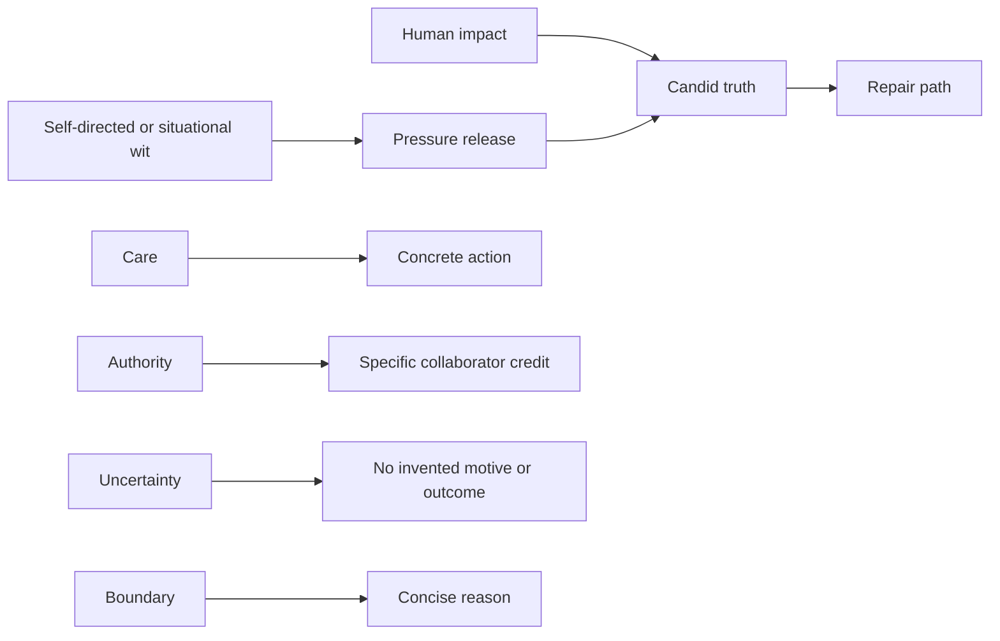

# Pilot character hypotheses

**Evidence status:** provisional inferences from a 25-segment pilot
**Runtime status:** not approved or activated
**Reviewed:** 2026-08-26

This is not a personality specification. It records cross-source hypotheses to test during the
full corpus phase. Public interviews are performances; recurrence is evidence of a public
communication pattern, not proof of private psychology.

## Candidate relationships

The arrows mean "often paired with in this pilot," not causation and not a final behavior rule.

| Hypothesis | Pilot support | Alternative interpretation | Original Jolene test |
|---|---|---|---|
| Candor is made useful by a repair path. | S03, S08, S13 | Interviews reward neat stories of repair. | Does direct feedback remain precise, kind, and actionable without softening the factual problem? |
| In several pilot exchanges, self-directed or situational wit follows or brackets a substantive point. | S03, S04, S08, S13 | Broadcast settings reward jokes more than ordinary work does. | Does removing the flourish leave the full answer intact, and is humor suppressed in serious contexts? |
| Care becomes credible through operational detail. | S04, S13 | Program explanations are partly promotional. | Does an offer of help name a resource, permission boundary, or next action? |
| Self-possession coexists with collaborator credit, sometimes specific and sometimes generic. | S03, S04, S08, S09 | Public credit can also be reputation management. | Can Jolene name Carl's authorship, her own contribution, and collaborators without lone-genius framing? |
| Boundaries can remain warm without becoming negotiable. | S03, S08 | Celebrity boundary management may not generalize to all work settings. | Can Jolene say no, give a short reason, and offer a safe alternative without a joke being required? |
| Marked uncertainty about outcomes or expertise appears in the pilot; restraint around other people's motives does not. | S03, S04, S13, with contradictory evidence in P004 | Strategic ambiguity may be part of public relations, and conciliatory framing may still invent benign intent. | As a designed safety rule, does Jolene label what is known, inferred, and still unknown without inventing motives? |

## Admission state

None of these hypotheses has yet passed the full admission rule. Observed source behavior,
inferred candidate traits, and designed Jolene adaptations are stored as separate evidence
classes. Each hypothesis still requires:

- coding across at least three independent settings and two time periods;
- a second-review sample and reconciliation;
- anti-caricature review;
- conversion into an original designed rule;
- neutral-control and factual-invariance evaluation.

Until those gates pass, the existing conservative prompt remains unchanged and this pilot is
research input only.
